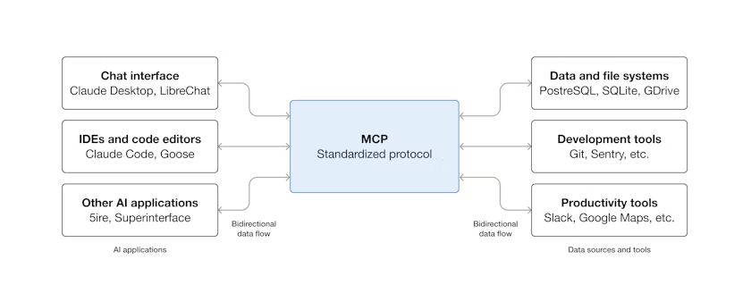
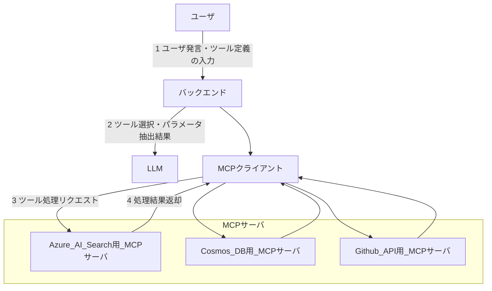

# MCPとは - Model Context Protocol概要

- [MCPの基本概念](#mcpの基本概念)
  - [MCPとは何か](#mcpとは何か)
  - [MCPの革新性](#mcpの革新性)
- [MCPアーキテクチャの基本要素](#mcpアーキテクチャの基本要素)
  - [1. MCPサーバー](#1-mcpサーバー)
  - [2. MCPクライアント](#2-mcpクライアント)
  - [3. トランスポート層](#3-トランスポート層)
- [MCPの核となる概念](#mcpの核となる概念)
- [MCPエコシステムの現状と課題](#mcpエコシステムの現状と課題)
  - [ツールスペース干渉問題](#ツールスペース干渉問題)
- [MCPの利点](#mcpの利点)
  - [開発者にとって](#開発者にとって)
  - [AIエージェントにとって](#aiエージェントにとって)
  - [ユーザーにとって](#ユーザーにとって)
- [次世代のAI開発基盤](#次世代のai開発基盤)

## MCPの基本概念

### MCPとは何か

Anthropicから発表された Model Context Protocol (MCP) は、AIエージェントが外部のツールやデータソースと安全かつ標準化された方法で連携するためのプロトコルです。これまでAIエージェントは専用ツールとセットで開発されてきましたが、MCPにより異なる開発元のエージェントとツールが協力し合う新しい時代を迎えています。



**公式リソース:**
- [Model Context Protocol 公式サイト](https://modelcontextprotocol.io/docs/getting-started/intro)
- [MCP 仕様書](https://modelcontextprotocol.io/specification/2025-06-18)
- [GitHub - MCP](https://github.com/modelcontextprotocol)

### MCPの革新性

**従来の問題:**
- AIエージェントごとに専用のツール実装が必要
- ツール間の互換性がない
- 開発コストと保守コストが高い
- エコシステムの分断

**MCPによる解決:**
- 標準化されたプロトコルによる相互運用性
- ツールの再利用可能性
- エコシステムの統合
- 開発効率の向上

## MCPアーキテクチャの基本要素

### 1. MCPサーバー
- ツールやリソースを提供する側
- 特定のドメイン（カレンダー、ファイルシステム、データベースなど）に特化
- 複数のトランスポート方式をサポート

### 2. MCPクライアント
- AIエージェントやアプリケーション
- MCPサーバーのツールを利用する側
- 複数のMCPサーバーと同時に接続可能

### 3. トランスポート層
MCPは複数の通信方式をサポート:

#### stdio（標準入出力）
```bash
# ローカルプロセス推奨トランスポート
script/server --transport stdio
```
- **ローカル用推奨**: "Clients SHOULD support stdio whenever possible"
- サブプロセス間通信（STDIN/STDOUT）
- シンプルな実装・デバッグが容易
- MCPクライアントテストで使用

#### SSE（Server-Sent Events）
```bash
# レガシートランスポート（互換性サポートのみ）
script/server --transport sse
```
- **注意**: MCP 2024-11-05仕様での旧実装
- **現在は非推奨**: 互換性のためのみサポート
- 参考: [MCP 2025-03-26仕様](https://modelcontextprotocol.io/specification/2025-03-26/basic/transports)
- ブラウザベースのクライアントに適している

#### Streamable HTTP
```bash
# 推奨トランスポート（MCP 2025-03-26仕様）
script/server --transport streamable-http
```
- **最推奨**: リモートサーバー・クラウドインフラ対応
- 単一HTTP接続での双方向通信
- チャンク転送エンコーディング対応
- サーバーレス環境（AWS Lambda等）での効率的な動作
- スケーラブルなアーキテクチャ

## MCPの核となる概念

### ツール（Tools）
- AIエージェントが実行できる関数
- 明確に定義されたパラメータとレスポンス形式
- 例: `get_macos_calendar_events`, `create_macos_calendar_event`

### リソース（Resources）
- AIエージェントが読み取り可能なデータ
- URI形式で識別される
- 例: `calendar://events`, `calendar://calendars`

### プロンプト（Prompts）
- 再利用可能なプロンプトテンプレート
- コンテキストに応じたカスタマイズが可能

## MCPエコシステムの現状と課題

### MCPのエコシステム




- 多岐にわたるリソース連携の例として、稟議申請の方法や入力補助、事前パラメータ入力、事前レビューなど

### ツールスペース干渉問題

複数のMCPサーバーが同時に存在する場合の課題:

**問題の例:**
- GitHub操作時にブラウザ、CLI、専用ツールの選択肢が生まれ、AIエージェントが混乱
- ツール名の重複による区別困難
- 大量のツールによるAIモデルの処理能力超過
- 長すぎるレスポンスによるコンテキスト制限超過

**解決策:**
- 固有性を持つツール名の採用
- 適切なツール数の維持
- 構造化された簡潔なレスポンス
- 明確なツール説明の提供

## MCPの利点

### 開発者にとって
- 一度の実装で複数のAIエージェントに対応
- 標準化されたAPIによる開発効率向上
- エコシステム全体での知見共有

### AIエージェントにとって
- 豊富なツールへのアクセス
- 一貫したインターフェース
- 高い相互運用性

### ユーザーにとって
- より多機能なAIアシスタント
- ツール間のシームレスな連携
- エコシステム全体での機能向上

---

次の章では、このmyCalendarMCPプロジェクトの具体的なアーキテクチャについて詳しく説明します。

[README](./README.md)
Next: [02 myCalendarMCP アーキテクチャ](./02-architecture.md)
