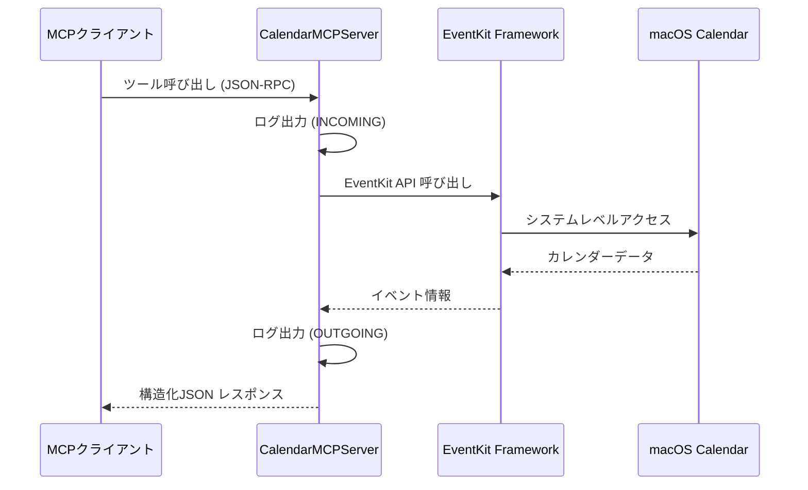
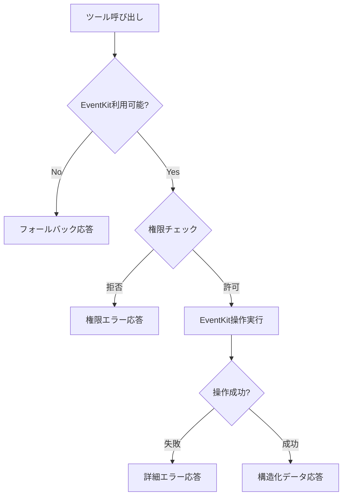

# mycalendarMCP アーキテクチャ

## プロジェクト構造

```
mycalendarMCP/
├── calendar_mcp/
│   ├── __init__.py
│   ├── __main__.py          # エントリーポイント、シグナルハンドラー
│   └── server.py            # FastMCP サーバー実装
├── script/
│   ├── server               # サーバー起動スクリプト
│   ├── test                 # テスト実行スクリプト
│   └── debug_tools.py       # デバッグツール
├── tests/
│   ├── conftest.py          # pytest 設定
│   └── test_tools.py        # MCPツール包括的テスト
├── docs/                    # プロジェクトドキュメント
├── CLAUDE.md               # プロジェクトメモリ
├── README.md               # プロジェクト概要
└── pyproject.toml          # プロジェクト設定
```

## コアコンポーネント

### 1. エントリーポイント (`calendar_mcp/__main__.py`)

```python
def signal_handler(signum, frame):
    """シグナルハンドラー: Ctrl+C での安全な終了"""

async def main():
    """メインエントリーポイント"""
    # シグナルハンドラー設定
    # サーバーインスタンス作成と起動
```

**役割:**
- アプリケーションの起動処理
- シグナルハンドリング（Ctrl+C での安全な終了）
- asyncio イベントループの管理

### 2. MCPサーバー (`calendar_mcp/server.py`)

#### サーバークラス設計

```python
class CalendarMCPServer:
    def __init__(self):
        self.mcp = FastMCP("mycalendar")
        self.event_store = None
        self._setup_tools()
        self._setup_resources()
```

**FastMCP統合:**
- FastMCP フレームワークを使用
- 自動的なツール・リソース登録
- JSON-RPC over 複数トランスポート

#### EventKit統合

```python
# EventKit 初期化
if EVENTKIT_AVAILABLE:
    self.event_store = EventKit.EKEventStore.alloc().init()
```

**技術的詳細:**
- `pyobjc-framework-EventKit` を使用
- macOS ネイティブカレンダーアプリとの連携
- システム権限管理（プライバシー設定）

### 3. ツール実装アーキテクチャ

#### ツール定義パターン

```python
@self.mcp.tool(
    name="get_macos_calendar_events",
    description="詳細な説明とパラメータ仕様",
    annotations=ToolAnnotations(
        title="人間が読みやすいタイトル",
        readOnlyHint=True,
        idempotentHint=True,
        openWorldHint=False
    ),
)
async def get_macos_calendar_events(
    start_date: str,
    end_date: str,
    calendar_name: str = None
) -> str:
```

**設計原則:**
- 非同期処理による高パフォーマンス
- 型ヒント活用による安全性
- 詳細なメタデータによるAIエージェント支援

#### 提供ツール

| ツール名 | 機能 | 特性 |
|---------|------|------|
| `get_macos_calendar_events` | イベント取得 | 読み取り専用、冪等 |
| `create_macos_calendar_event` | イベント作成 | 破壊的、非冪等 |
| `list_macos_calendars` | カレンダー一覧 | 読み取り専用、冪等 |

### 4. リソース実装アーキテクチャ

#### リソース定義パターン

```python
@self.mcp.resource("calendar://events")
async def calendar_events_resource() -> str:
    """近日のカレンダーイベント一覧リソース"""
```

**提供リソース:**
- `calendar://events`: 近日のイベント一覧
- `calendar://calendars`: 利用可能なカレンダー一覧

## データフロー

### 1. 通常のMCPツール呼び出し



### 2. エラーハンドリングフロー



## トランスポート層の実装

### asyncio イベントループ統合

```python
# calendar_mcp/server.py:272-280
if args.transport == "sse":
    await server_instance.mcp.run_sse_async(mount_path=args.mount_path)
elif args.transport == "stdio":
    await server_instance.mcp.run_stdio_async()
elif args.transport == "streamable-http":
    await server_instance.mcp.run_streamable_http_async()
```

**技術的解決策:**
- FastMCP の `run()` は内部で `anyio.run()` を呼び出すため、既存の asyncio イベントループ内では使用不可
- 各トランスポート専用の async メソッドを使用
- 二重イベントループ問題の回避

### 利用可能なトランスポート

| トランスポート | 用途 | 特徴 |
|---------------|------|------|
| `stdio` | CLI/デバッグ | シンプル、デバッグ容易 |
| `sse` | Web統合 | リアルタイム、ブラウザ対応 |
| `streamable-http` | 高性能 | HTTP/2、大量データ転送 |

## ログ・監視アーキテクチャ

### JSON構造化ログ

```python
def log_json_data(logger, direction: str, data_type: str, data):
    """JSON形式でのログ出力"""
    logger.info(f"[{direction}] {data_type}:")
    logger.info(json.dumps(data, indent=2, ensure_ascii=False))
```

**ログカテゴリ:**
- `[INCOMING]`: クライアントからのリクエスト
- `[OUTGOING]`: サーバーからのレスポンス

**出力フォーマット:**
```
2024-09-18 10:30:15,123 - calendar_mcp.server.json_data - [INCOMING] TOOL REQUEST:
{
  "name": "get_events",
  "arguments": {...}
}
```

## パフォーマンス設計

### EventKit最適化

```python
# EventStore インスタンスの再利用
self.event_store = EventKit.EKEventStore.alloc().init()

# 非同期処理パターン
async def get_macos_calendar_events(...) -> str:
    # EventKit操作の非同期化
```

**最適化戦略:**
- EventStore インスタンスの再利用
- 非同期処理による応答性向上
- レスポンスサイズの制限（推奨: 1000件/10MB以下）
- 適切なタイムアウト設定（5秒以内）

### メモリ管理

- NSDate オブジェクトのリーク防止
- EventKit リソースの適切な解放
- JSONログのローテーション対応

## セキュリティアーキテクチャ

### 権限管理

```python
# システムレベルのプライバシー制御
try:
    self.event_store = EventKit.EKEventStore.alloc().init()
except Exception as e:
    logger.error(f"EventKit initialization failed: {e}")
    return {"status": "unavailable", "reason": "EventKit access denied"}
```

**セキュリティ層:**
1. **システムレベル**: macOS プライバシー設定
2. **アプリケーションレベル**: EventKit権限チェック
3. **MCPレベル**: 入力検証とサニタイゼーション

### データ保護

- カレンダーデータの読み取り専用アクセス（get_events, list_calendars）
- 書き込み操作の明示的な許可（create_event）
- 機密情報のログ出力回避

## 拡張性設計

### 新しいツールの追加

```python
@self.mcp.tool(
    name="new_tool_name",
    description="ツール説明",
    annotations=ToolAnnotations(...)
)
async def new_tool_function(...) -> str:
    """新しいツールの実装"""
```

### 新しいトランスポートの対応

```python
# server.py での拡張例
elif args.transport == "new_transport":
    await server_instance.mcp.run_new_transport_async()
```

このアーキテクチャにより、高性能で拡張可能、かつ安全なMCPサーバーを実現しています。

---

次の章では、MCPサーバー開発におけるベストプラクティスについて詳しく説明します。