# myCalendarMCP アーキテクチャ

- [プロジェクト構造](#プロジェクト構造)
- [コアコンポーネント](#コアコンポーネント)
  - [1. エントリーポイント (`calendar_mcp/__main__.py`)](#1-エントリーポイント-calendar_mcp__main__py)
  - [2. MCPサーバー (`calendar_mcp/server.py`)](#2-mcpサーバー-calendar_mcpserverpy)
  - [3. ツール実装アーキテクチャ](#3-ツール実装アーキテクチャ)
  - [4. リソース実装アーキテクチャ](#4-リソース実装アーキテクチャ)
- [テストアーキテクチャ](#テストアーキテクチャ)
  - [テスト戦略概要](#テスト戦略概要)
  - [MCPクライアント統合テスト](#mcpクライアント統合テスト)
  - [単体テストとの関係性](#単体テストとの関係性)
- [データフロー](#データフロー)
  - [1. 通常のMCPツール呼び出し](#1-通常のmcpツール呼び出し)
  - [2. サーバー初期化とトランスポート接続](#2-サーバー初期化とトランスポート接続)
  - [3. イベント作成フロー](#3-イベント作成フロー)
  - [4. エラーハンドリングフロー](#4-エラーハンドリングフロー)
  - [5. LLMを含む完全なリソース取得フロー](#5-llmを含む完全なリソース取得フロー)
  - [6. MCPクライアント統合テストフロー](#6-mcpクライアント統合テストフロー)
- [トランスポート層の実装](#トランスポート層の実装)
  - [asyncio イベントループ統合](#asyncio-イベントループ統合)
  - [利用可能なトランスポート](#利用可能なトランスポート)
- [ログ・監視アーキテクチャ](#ログ監視アーキテクチャ)
  - [JSON構造化ログ](#json構造化ログ)
- [パフォーマンス設計](#パフォーマンス設計)
  - [EventKit最適化](#eventkit最適化)
  - [メモリ管理](#メモリ管理)
- [セキュリティアーキテクチャ](#セキュリティアーキテクチャ)
  - [権限管理](#権限管理)
  - [データ保護](#データ保護)
- [拡張性設計](#拡張性設計)
  - [新しいツールの追加](#新しいツールの追加)
  - [新しいトランスポートの対応](#新しいトランスポートの対応)

## プロジェクト構造

```
myCalendarMCP/
├── calendar_mcp/
│   ├── __init__.py
│   ├── __main__.py          # エントリーポイント、シグナルハンドラー
│   └── server.py            # FastMCP サーバー実装
├── script/
│   ├── server               # サーバー起動スクリプト
│   ├── test                 # テスト実行スクリプト
│   ├── mcp_client_test      # MCPクライアント統合テストスクリプト
│   ├── query                # 直接クエリスクリプト
│   └── debug_tools.py       # デバッグツール
├── tests/
│   ├── conftest.py          # pytest 設定
│   └── test_tools.py        # MCPツール包括的テスト
├── docs/                    # プロジェクトドキュメント
├── CLAUDE.md               # プロジェクトメモリ
├── README.md               # プロジェクト概要
└── pyproject.toml          # プロジェクト設定
```

### スクリプト層の詳細

| スクリプト | 目的 | 実行方法 | 特徴 |
|-----------|------|---------|------|
| `script/server` | MCPサーバー起動 | `./script/server [--transport TYPE]` | 3つのトランスポート対応 |
| `script/test` | 単体テスト実行 | `./script/test` | pytest実行、型チェック含む |
| `script/mcp_client_test` | MCPクライアント統合テスト | `./script/mcp_client_test` | 実際のMCPプロトコル検証 |
| `script/query` | 直接クエリツール | `./script/query "query"` | 開発・デバッグ用簡易アクセス |

## コアコンポーネント

### 1. エントリーポイント (`calendar_mcp/__main__.py`)

```python
def signal_handler(signum, frame):
    """シグナルハンドラー: Ctrl+C での安全な終了"""

async def main():
    """メインエントリーポイント"""
    # シグナルハンドラー設定
    # サーバーインスタンス作成と起動
```

**役割:**
- アプリケーションの起動処理
- シグナルハンドリング（Ctrl+C での安全な終了）
- asyncio イベントループの管理

### 2. MCPサーバー (`calendar_mcp/server.py`)

#### サーバークラス設計

```python
class CalendarMCPServer:
    def __init__(self):
        self.mcp = FastMCP("mycalendar")
        self.event_store = None
        self._setup_tools()
        self._setup_resources()
```

**FastMCP統合:**
- FastMCP フレームワークを使用
- 自動的なツール・リソース登録
- JSON-RPC over 複数トランスポート

#### EventKit統合

```python
# EventKit 初期化
if EVENTKIT_AVAILABLE:
    self.event_store = EventKit.EKEventStore.alloc().init()
```

**技術的詳細:**
- `pyobjc-framework-EventKit` を使用
- macOS ネイティブカレンダーアプリとの連携
- システム権限管理（プライバシー設定）

### 3. ツール実装アーキテクチャ

#### ツール定義パターン

```python
@self.mcp.tool(
    name="get_macos_calendar_events",
    description="詳細な説明とパラメータ仕様",
    annotations=ToolAnnotations(
        title="人間が読みやすいタイトル",
        readOnlyHint=True,
        idempotentHint=True,
        openWorldHint=False
    ),
)
async def get_macos_calendar_events(
    start_date: str,
    end_date: str,
    calendar_name: str = None
) -> str:
```

**設計原則:**
- 非同期処理による高パフォーマンス
- 型ヒント活用による安全性
- 詳細なメタデータによるAIエージェント支援

#### 提供ツール

| ツール名 | 機能 | 特性 |
|---------|------|------|
| `get_macos_calendar_events` | イベント取得 | 読み取り専用、冪等 |
| `create_macos_calendar_event` | イベント作成 | 破壊的、非冪等 |
| `list_macos_calendars` | カレンダー一覧 | 読み取り専用、冪等 |

### 4. リソース実装アーキテクチャ

#### リソース定義パターン

```python
@self.mcp.resource("calendar://events")
async def calendar_events_resource() -> str:
    """近日のカレンダーイベント一覧リソース"""
```

**提供リソース:**
- `calendar://events`: 近日のイベント一覧
- `calendar://calendars`: 利用可能なカレンダー一覧

## テストアーキテクチャ

### テスト戦略概要

myCalendarMCPでは、MCPサーバーの品質を保証するため、複数レイヤーでのテスト戦略を採用しています。

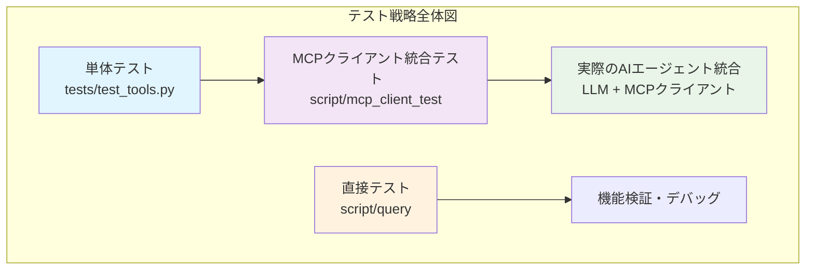
```mermaid
graph TB
    subgraph "テスト戦略全体図"
        A[単体テスト<br/>tests/test_tools.py] --> B[MCPクライアント統合テスト<br/>script/mcp_client_test]
        B --> C[実際のAIエージェント統合<br/>LLM + MCPクライアント]

        D[直接テスト<br/>script/query] --> E[機能検証・デバッグ]

        style A fill:#e1f5fe
        style B fill:#f3e5f5
        style C fill:#e8f5e8
        style D fill:#fff3e0
    end
```

**テスト層の役割分担:**

| テスト種別 | 対象範囲 | 検証内容 | 実行方法 |
|-----------|---------|---------|---------|
| **単体テスト** | MCPツール内部ロジック | 個別機能、エラーハンドリング | `./script/test` |
| **統合テスト** | MCPプロトコル全体 | クライアント・サーバー通信 | `./script/mcp_client_test` |
| **機能テスト** | 直接サーバー呼び出し | 開発・デバッグ用 | `./script/query` |

### MCPクライアント統合テスト

`script/mcp_client_test` は実際のMCPクライアント実装を使用して、MCPサーバーの動作を包括的に検証します。

#### アーキテクチャ構成

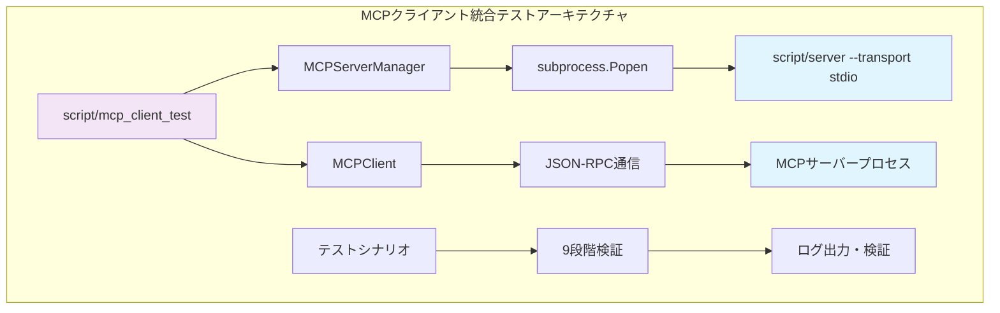
```mermaid
graph TB
    subgraph "MCPクライアント統合テストアーキテクチャ"
        A[script/mcp_client_test] --> B[MCPServerManager]
        A --> C[MCPClient]

        B --> D[subprocess.Popen]
        D --> E[script/server --transport stdio]

        C --> F[JSON-RPC通信]
        F --> G[MCPサーバープロセス]

        H[テストシナリオ] --> I[9段階検証]
        I --> J[ログ出力・検証]

        style A fill:#f3e5f5
        style E fill:#e1f5fe
        style G fill:#e1f5fe
    end
```

#### 実装クラス設計

**MCPServerManager クラス:**
```python
class MCPServerManager:
    """MCPサーバーの起動・停止を管理"""

    async def start_server(self, transport="stdio"):
        # script/server プロセス起動
        # stdin/stdout/stderr 管理
        # 起動確認とタイムアウト処理

    def stop_server(self):
        # プロセス終了処理
        # リソースクリーンアップ
        # タイムアウト制御
```

**MCPClient クラス:**
```python
class MCPClient:
    """簡単なMCPクライアント実装"""

    def send_request(self, method, params=None):
        # JSON-RPC リクエスト生成・送信
        # レスポンス受信・解析
        # エラーハンドリング

    def initialize(self):
        # MCPプロトコル初期化
        # initialize → notifications/initialized
```

#### 検証カバレッジ

**プロトコルレベル検証:**
- JSON-RPC 2.0 準拠性
- MCP初期化シーケンス
- エラーレスポンス形式
- タイムアウト処理

**機能レベル検証:**
- 全MCPツールの呼び出し
- 全MCPリソースの読み取り
- パラメータバリデーション
- レスポンス形式確認

**システムレベル検証:**
- プロセス間通信
- リソース管理
- ログ出力品質
- クリーンアップ処理

### 単体テストとの関係性

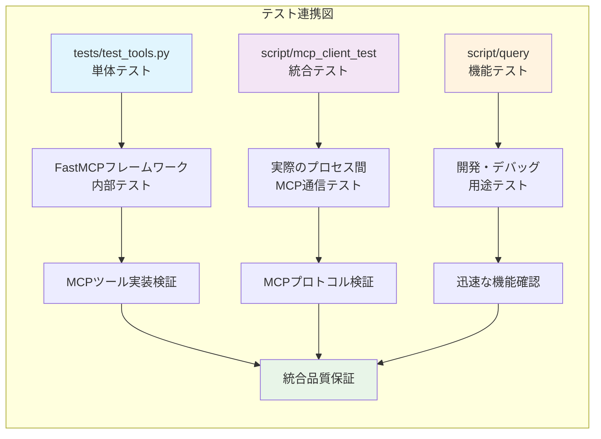
```mermaid
graph LR
    subgraph "テスト連携図"
        A[tests/test_tools.py<br/>単体テスト] --> B[FastMCPフレームワーク<br/>内部テスト]

        C[script/mcp_client_test<br/>統合テスト] --> D[実際のプロセス間<br/>MCP通信テスト]

        E[script/query<br/>機能テスト] --> F[開発・デバッグ<br/>用途テスト]

        B --> G[MCPツール実装検証]
        D --> H[MCPプロトコル検証]
        F --> I[迅速な機能確認]

        G --> J[統合品質保証]
        H --> J
        I --> J

        style A fill:#e1f5fe
        style C fill:#f3e5f5
        style E fill:#fff3e0
        style J fill:#e8f5e8
    end
```

**相互補完関係:**

1. **単体テスト (tests/test_tools.py)**
   - MCPツール内部ロジックの詳細検証
   - エッジケース・エラー条件の網羅的テスト
   - 高速実行によるTDD支援

2. **統合テスト (script/mcp_client_test)**
   - 実際のプロトコル通信検証
   - エンドツーエンドの動作確認
   - 本番環境と同じ通信経路テスト

3. **機能テスト (script/query)**
   - 迅速な機能確認
   - 開発中のデバッグ支援
   - 人間によるアドホック検証

## データフロー

myCalendarMCPのデータフローは、ツール呼び出しからエラーハンドリング、初期化プロセスまでの主要な処理をシーケンス図とフローチャートで視覚化します。

### 1. 通常のMCPツール呼び出し

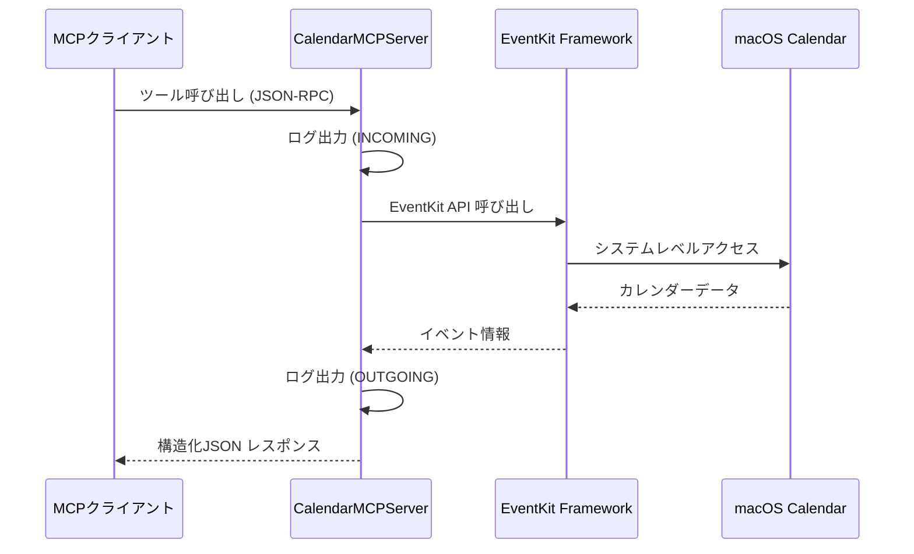
```mermaid
sequenceDiagram
    participant Client as MCPクライアント
    participant Server as CalendarMCPServer
    participant EventKit as EventKit Framework
    participant Calendar as macOS Calendar

    Client->>Server: ツール呼び出し (JSON-RPC)
    Server->>Server: ログ出力 (INCOMING)
    Server->>EventKit: EventKit API 呼び出し
    EventKit->>Calendar: システムレベルアクセス
    Calendar-->>EventKit: カレンダーデータ
    EventKit-->>Server: イベント情報
    Server->>Server: ログ出力 (OUTGOING)
    Server-->>Client: 構造化JSON レスポンス
```

### 2. サーバー初期化とトランスポート接続

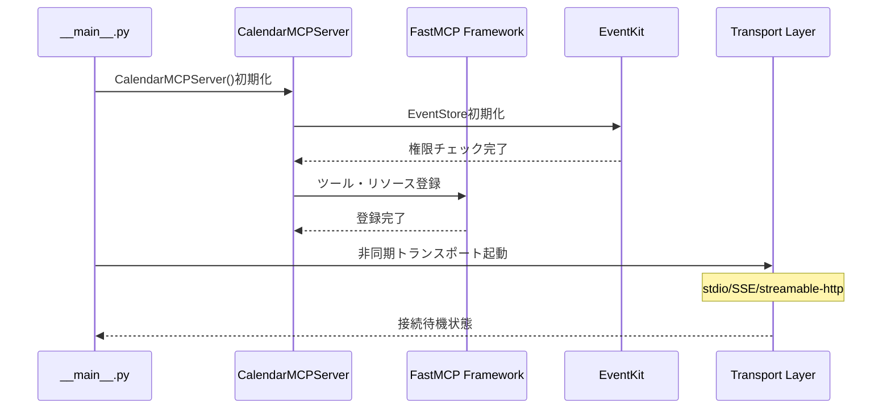
```mermaid
sequenceDiagram
    participant Main as __main__.py
    participant Server as CalendarMCPServer
    participant FastMCP as FastMCP Framework
    participant EventKit as EventKit
    participant Transport as Transport Layer

    Main->>Server: CalendarMCPServer()初期化
    Server->>EventKit: EventStore初期化
    EventKit-->>Server: 権限チェック完了
    Server->>FastMCP: ツール・リソース登録
    FastMCP-->>Server: 登録完了
    Main->>Transport: 非同期トランスポート起動
    note over Transport: stdio/SSE/streamable-http
    Transport-->>Main: 接続待機状態
```

### 3. イベント作成フロー

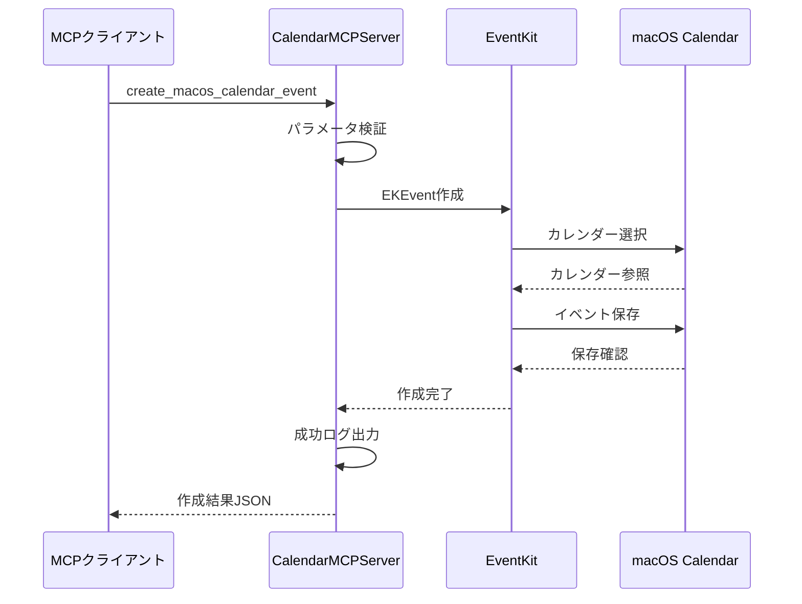
```mermaid
sequenceDiagram
    participant Client as MCPクライアント
    participant Server as CalendarMCPServer
    participant EventKit as EventKit
    participant Calendar as macOS Calendar

    Client->>Server: create_macos_calendar_event
    Server->>Server: パラメータ検証
    Server->>EventKit: EKEvent作成
    EventKit->>Calendar: カレンダー選択
    Calendar-->>EventKit: カレンダー参照
    EventKit->>Calendar: イベント保存
    Calendar-->>EventKit: 保存確認
    EventKit-->>Server: 作成完了
    Server->>Server: 成功ログ出力
    Server-->>Client: 作成結果JSON
```

### 4. エラーハンドリングフロー

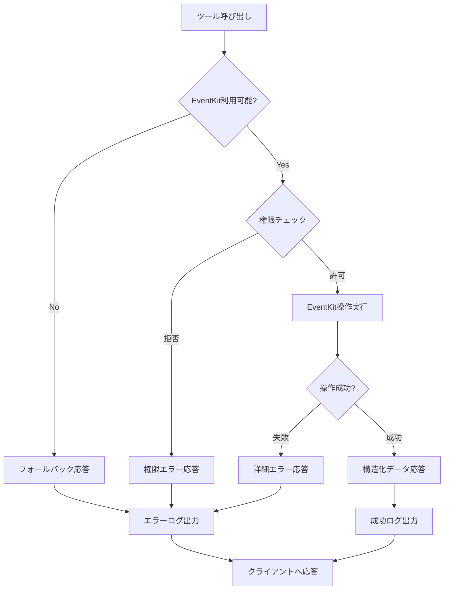
```mermaid
flowchart TD
    A[ツール呼び出し] --> B{EventKit利用可能?}
    B -->|No| C[フォールバック応答]
    B -->|Yes| D{権限チェック}
    D -->|拒否| E[権限エラー応答]
    D -->|許可| F[EventKit操作実行]
    F --> G{操作成功?}
    G -->|失敗| H[詳細エラー応答]
    G -->|成功| I[構造化データ応答]

    C --> J[エラーログ出力]
    E --> J
    H --> J
    I --> K[成功ログ出力]
    J --> L[クライアントへ応答]
    K --> L
```

### 5. LLMを含む完全なリソース取得フロー

LLMを含むリソース取得フローは、自然言語理解、動的判断、反復的問い合わせを含むプロセスです。ユーザーの自然言語入力から最終応答生成まで、LLMがMCPシステムと協調する流れを説明します。

#### 5.1. LLMによる自然言語理解と初期計画

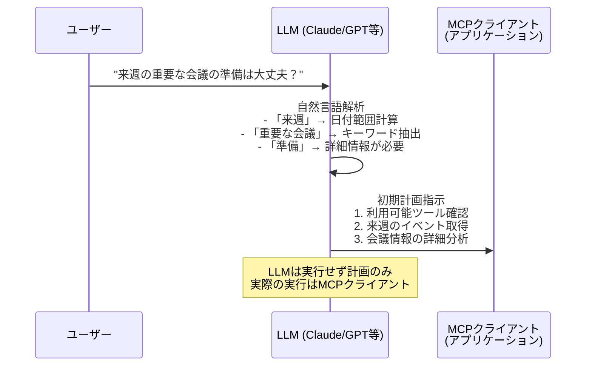
```mermaid
sequenceDiagram
    participant User as ユーザー
    participant LLM as LLM (Claude/GPT等)
    participant Client as MCPクライアント<br/>(アプリケーション)

    User->>LLM: "来週の重要な会議の準備は大丈夫？"
    LLM->>LLM: 自然言語解析<br/>- 「来週」→ 日付範囲計算<br/>- 「重要な会議」→ キーワード抽出<br/>- 「準備」→ 詳細情報が必要
    LLM->>Client: 初期計画指示<br/>1. 利用可能ツール確認<br/>2. 来週のイベント取得<br/>3. 会議情報の詳細分析

    note over LLM: LLMは実行せず計画のみ<br/>実際の実行はMCPクライアント
```

#### 5.2. MCPクライアントによるツール発見フェーズ

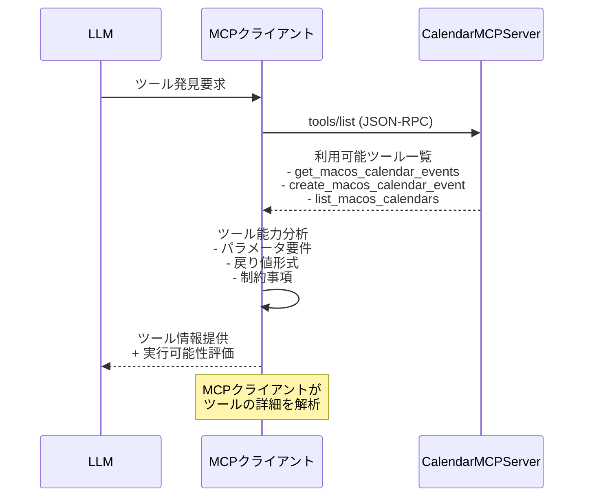
```mermaid
sequenceDiagram
    participant LLM as LLM
    participant Client as MCPクライアント
    participant Server as CalendarMCPServer

    LLM->>Client: ツール発見要求
    Client->>Server: tools/list (JSON-RPC)
    Server-->>Client: 利用可能ツール一覧<br/>- get_macos_calendar_events<br/>- create_macos_calendar_event<br/>- list_macos_calendars
    Client->>Client: ツール能力分析<br/>- パラメータ要件<br/>- 戻り値形式<br/>- 制約事項
    Client-->>LLM: ツール情報提供<br/>+ 実行可能性評価

    note over Client: MCPクライアントが<br/>ツールの詳細を解析
```

#### 5.3. 段階的ツール実行フェーズ

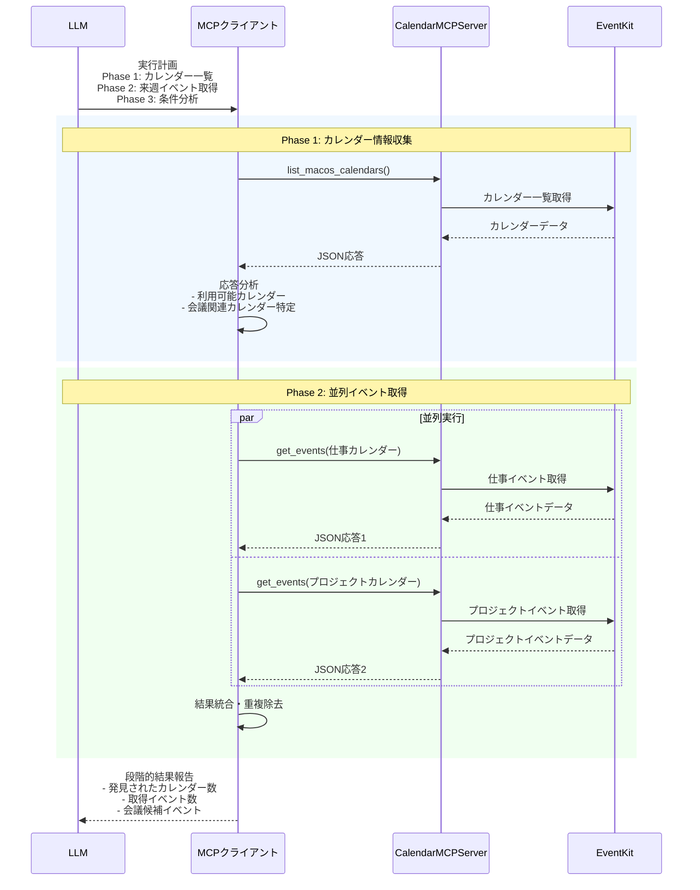
```mermaid
sequenceDiagram
    participant LLM as LLM
    participant Client as MCPクライアント
    participant Server as CalendarMCPServer
    participant EventKit as EventKit

    LLM->>Client: 実行計画<br/>Phase 1: カレンダー一覧<br/>Phase 2: 来週イベント取得<br/>Phase 3: 条件分析

    %% Phase 1: カレンダー情報取得
    rect rgb(240, 248, 255)
        note over LLM, EventKit: Phase 1: カレンダー情報収集
        Client->>Server: list_macos_calendars()
        Server->>EventKit: カレンダー一覧取得
        EventKit-->>Server: カレンダーデータ
        Server-->>Client: JSON応答
        Client->>Client: 応答分析<br/>- 利用可能カレンダー<br/>- 会議関連カレンダー特定
    end

    %% Phase 2: 並列イベント取得
    rect rgb(240, 255, 240)
        note over LLM, EventKit: Phase 2: 並列イベント取得
        par 並列実行
            Client->>Server: get_events(仕事カレンダー)
            Server->>EventKit: 仕事イベント取得
            EventKit-->>Server: 仕事イベントデータ
            Server-->>Client: JSON応答1
        and
            Client->>Server: get_events(プロジェクトカレンダー)
            Server->>EventKit: プロジェクトイベント取得
            EventKit-->>Server: プロジェクトイベントデータ
            Server-->>Client: JSON応答2
        end
        Client->>Client: 結果統合・重複除去
    end

    Client-->>LLM: 段階的結果報告<br/>- 発見されたカレンダー数<br/>- 取得イベント数<br/>- 会議候補イベント
```

#### 5.4. LLMによる動的判断と追加問い合わせ

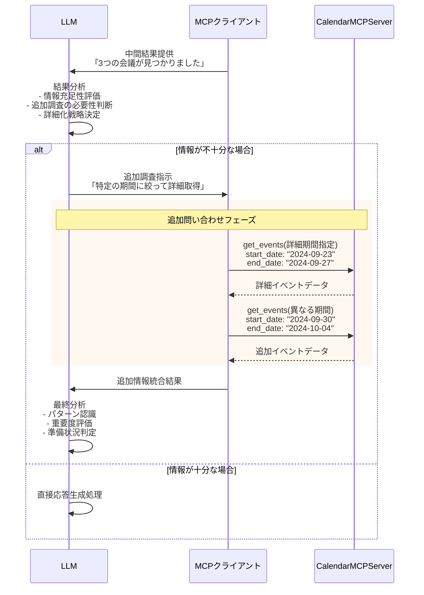
```mermaid
sequenceDiagram
    participant LLM as LLM
    participant Client as MCPクライアント
    participant Server as CalendarMCPServer

    Client->>LLM: 中間結果提供<br/>「3つの会議が見つかりました」
    LLM->>LLM: 結果分析<br/>- 情報充足性評価<br/>- 追加調査の必要性判断<br/>- 詳細化戦略決定

    alt 情報が不十分な場合
        LLM->>Client: 追加調査指示<br/>「特定の期間に絞って詳細取得」

        rect rgb(255, 248, 240)
            note over LLM, Server: 追加問い合わせフェーズ
            Client->>Server: get_events(詳細期間指定)<br/>start_date: "2024-09-23"<br/>end_date: "2024-09-27"
            Server-->>Client: 詳細イベントデータ

            Client->>Server: get_events(異なる期間)<br/>start_date: "2024-09-30"<br/>end_date: "2024-10-04"
            Server-->>Client: 追加イベントデータ
        end

        Client->>LLM: 追加情報統合結果
        LLM->>LLM: 最終分析<br/>- パターン認識<br/>- 重要度評価<br/>- 準備状況判定
    else 情報が十分な場合
        LLM->>LLM: 直接応答生成処理
    end
```

#### 5.5. 反復的精緻化と最終応答生成

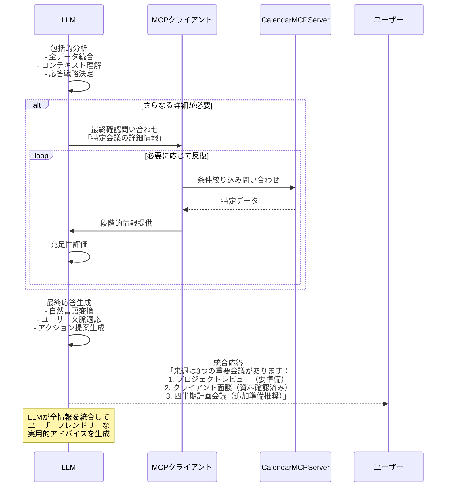
```mermaid
sequenceDiagram
    participant LLM as LLM
    participant Client as MCPクライアント
    participant Server as CalendarMCPServer
    participant User as ユーザー

    LLM->>LLM: 包括的分析<br/>- 全データ統合<br/>- コンテキスト理解<br/>- 応答戦略決定

    alt さらなる詳細が必要
        LLM->>Client: 最終確認問い合わせ<br/>「特定会議の詳細情報」

        loop 必要に応じて反復
            Client->>Server: 条件絞り込み問い合わせ
            Server-->>Client: 特定データ
            Client->>LLM: 段階的情報提供
            LLM->>LLM: 充足性評価
        end
    end

    LLM->>LLM: 最終応答生成<br/>- 自然言語変換<br/>- ユーザー文脈適応<br/>- アクション提案生成

    LLM-->>User: 統合応答<br/>「来週は3つの重要会議があります：<br/>1. プロジェクトレビュー（要準備）<br/>2. クライアント面談（資料確認済み）<br/>3. 四半期計画会議（追加準備推奨）」

    note over LLM: LLMが全情報を統合して<br/>ユーザーフレンドリーな<br/>実用的アドバイスを生成
```

#### 5.6. 実行パターンと最適化戦略

上記のフローにおいて、LLMとMCPクライアントは以下の実行パターンを採用します：

**並列実行の判断基準：**
- 独立性: 問い合わせが相互に依存しない場合（異なるカレンダー、異なる期間）
- 効率性: 同時実行により全体の応答時間を短縮できる場合
- リソース制約: MCPサーバーの処理能力とネットワーク帯域を考慮

**逐次実行の選択理由：**
- 依存関係: 前の結果に基づいて次の問い合わせパラメータを決定する必要がある場合
- 条件分岐: LLMが中間結果を評価して戦略を変更する必要がある場合
- エラー処理: 前の問い合わせが失敗した場合の代替戦略実行

**反復回数の動的制御：**
- 初期問い合わせ: 1-2回（基本情報収集）
- 精緻化問い合わせ: 0-3回（LLMの判断による）
- 最終確認問い合わせ: 0-1回（必要に応じて）
- 合計最大: 6回程度（タイムアウト制御含む）

この包括的フローにより、LLMはユーザー意図を理解し、動的な情報収集戦略を実行し、文脈に適した応答を生成します。

### 6. MCPクライアント統合テストフロー

`script/mcp_client_test` の実行フローを詳細に図解します。このフローは実際のMCPクライアント・サーバー通信を検証する重要なテストシナリオです。

#### 6.1. テスト初期化とサーバー起動

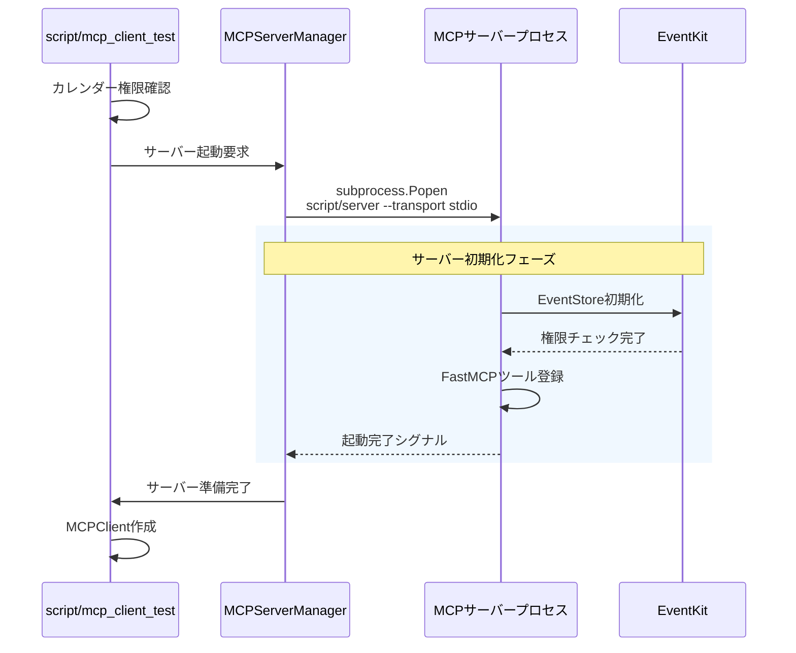
```mermaid
sequenceDiagram
    participant Test as script/mcp_client_test
    participant Manager as MCPServerManager
    participant Server as MCPサーバープロセス
    participant EventKit as EventKit

    Test->>Test: カレンダー権限確認
    Test->>Manager: サーバー起動要求
    Manager->>Server: subprocess.Popen<br/>script/server --transport stdio

    rect rgb(240, 248, 255)
        note over Manager, EventKit: サーバー初期化フェーズ
        Server->>EventKit: EventStore初期化
        EventKit-->>Server: 権限チェック完了
        Server->>Server: FastMCPツール登録
        Server-->>Manager: 起動完了シグナル
    end

    Manager->>Test: サーバー準備完了
    Test->>Test: MCPClient作成
```

#### 6.2. MCPプロトコル初期化とハンドシェイク

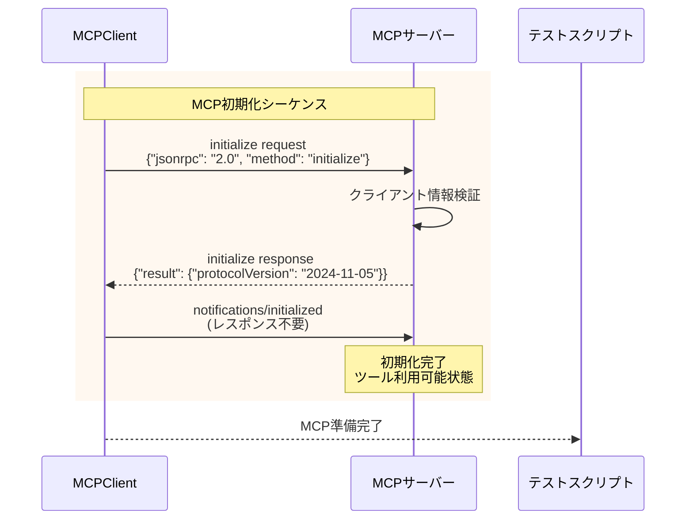
```mermaid
sequenceDiagram
    participant Client as MCPClient
    participant Server as MCPサーバー
    participant Test as テストスクリプト

    rect rgb(255, 248, 240)
        note over Client, Server: MCP初期化シーケンス
        Client->>Server: initialize request<br/>{"jsonrpc": "2.0", "method": "initialize"}
        Server->>Server: クライアント情報検証
        Server-->>Client: initialize response<br/>{"result": {"protocolVersion": "2024-11-05"}}

        Client->>Server: notifications/initialized<br/>(レスポンス不要)
        note over Server: 初期化完了<br/>ツール利用可能状態
    end

    Client-->>Test: MCP準備完了
```

#### 6.3. 段階的テストシナリオ実行

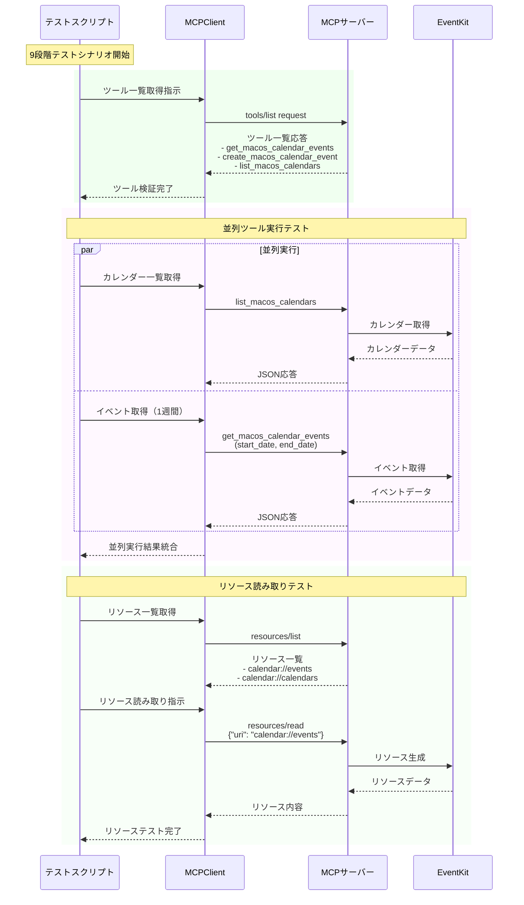
```mermaid
sequenceDiagram
    participant Test as テストスクリプト
    participant Client as MCPClient
    participant Server as MCPサーバー
    participant EventKit as EventKit

    note over Test: 9段階テストシナリオ開始

    %% Step 5: ツール一覧取得
    rect rgb(240, 255, 240)
        Test->>Client: ツール一覧取得指示
        Client->>Server: tools/list request
        Server-->>Client: ツール一覧応答<br/>- get_macos_calendar_events<br/>- create_macos_calendar_event<br/>- list_macos_calendars
        Client-->>Test: ツール検証完了
    end

    %% Step 6-7: 並列ツール実行
    rect rgb(255, 248, 255)
        note over Test, EventKit: 並列ツール実行テスト
        par 並列実行
            Test->>Client: カレンダー一覧取得
            Client->>Server: list_macos_calendars
            Server->>EventKit: カレンダー取得
            EventKit-->>Server: カレンダーデータ
            Server-->>Client: JSON応答
        and
            Test->>Client: イベント取得（1週間）
            Client->>Server: get_macos_calendar_events<br/>(start_date, end_date)
            Server->>EventKit: イベント取得
            EventKit-->>Server: イベントデータ
            Server-->>Client: JSON応答
        end
        Client-->>Test: 並列実行結果統合
    end

    %% Step 8-9: リソーステスト
    rect rgb(248, 255, 248)
        note over Test, EventKit: リソース読み取りテスト
        Test->>Client: リソース一覧取得
        Client->>Server: resources/list
        Server-->>Client: リソース一覧<br/>- calendar://events<br/>- calendar://calendars

        Test->>Client: リソース読み取り指示
        Client->>Server: resources/read<br/>{"uri": "calendar://events"}
        Server->>EventKit: リソース生成
        EventKit-->>Server: リソースデータ
        Server-->>Client: リソース内容
        Client-->>Test: リソーステスト完了
    end
```

#### 6.4. ログ出力とクリーンアップ

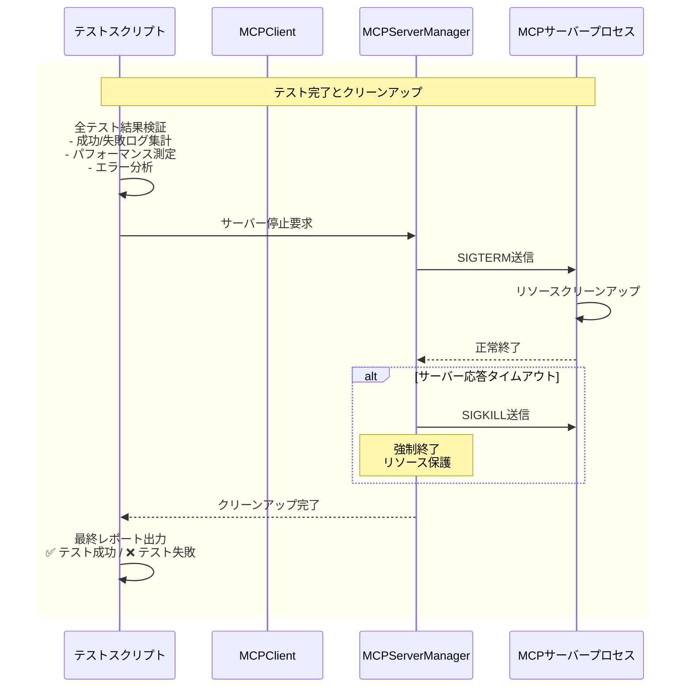
```mermaid
sequenceDiagram
    participant Test as テストスクリプト
    participant Client as MCPClient
    participant Manager as MCPServerManager
    participant Server as MCPサーバープロセス

    rect rgb(255, 255, 240)
        note over Test, Server: テスト完了とクリーンアップ
        Test->>Test: 全テスト結果検証<br/>- 成功/失敗ログ集計<br/>- パフォーマンス測定<br/>- エラー分析

        Test->>Manager: サーバー停止要求
        Manager->>Server: SIGTERM送信
        Server->>Server: リソースクリーンアップ
        Server-->>Manager: 正常終了

        alt サーバー応答タイムアウト
            Manager->>Server: SIGKILL送信
            note over Manager: 強制終了<br/>リソース保護
        end

        Manager-->>Test: クリーンアップ完了
        Test->>Test: 最終レポート出力<br/>✅ テスト成功 / ❌ テスト失敗
    end
```

#### 6.5. テストカバレッジマトリクス

統合テストによって検証される項目を体系的に整理：

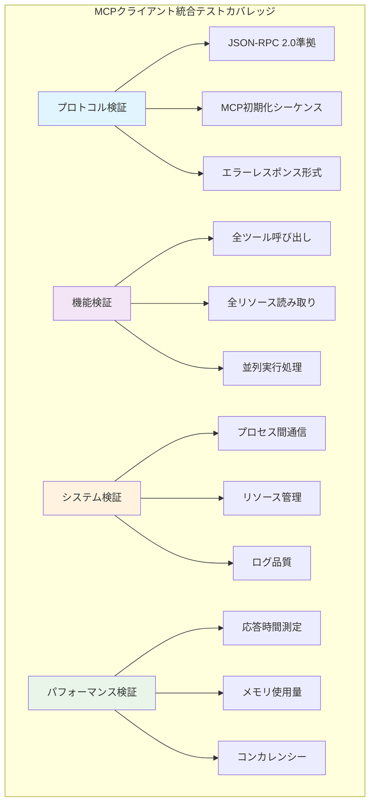
```mermaid
graph TB
    subgraph "MCPクライアント統合テストカバレッジ"
        A[プロトコル検証] --> A1[JSON-RPC 2.0準拠]
        A --> A2[MCP初期化シーケンス]
        A --> A3[エラーレスポンス形式]

        B[機能検証] --> B1[全ツール呼び出し]
        B --> B2[全リソース読み取り]
        B --> B3[並列実行処理]

        C[システム検証] --> C1[プロセス間通信]
        C --> C2[リソース管理]
        C --> C3[ログ品質]

        D[パフォーマンス検証] --> D1[応答時間測定]
        D --> D2[メモリ使用量]
        D --> D3[コンカレンシー]

        style A fill:#e1f5fe
        style B fill:#f3e5f5
        style C fill:#fff3e0
        style D fill:#e8f5e8
    end
```

このテストフローにより、MCPサーバーの実際の動作環境での品質を保証し、本番環境での問題を事前に検出できます。

## トランスポート層の実装

### asyncio イベントループ統合

```python
# calendar_mcp/server.py:272-280
if args.transport == "sse":
    await server_instance.mcp.run_sse_async(mount_path=args.mount_path)
elif args.transport == "stdio":
    await server_instance.mcp.run_stdio_async()
elif args.transport == "streamable-http":
    await server_instance.mcp.run_streamable_http_async()
```

**技術的解決策:**
- FastMCP の `run()` は内部で `anyio.run()` を呼び出すため、既存の asyncio イベントループ内では使用不可
- 各トランスポート専用の async メソッドを使用
- 二重イベントループ問題の回避

### 利用可能なトランスポート

| トランスポート | 用途 | 特徴 |
|---------------|------|------|
| `stdio` | CLI/デバッグ | シンプル、デバッグ容易 |
| `sse` | Web統合 | リアルタイム、ブラウザ対応 |
| `streamable-http` | 高性能 | HTTP/2、大量データ転送 |

## ログ・監視アーキテクチャ

### JSON構造化ログ

```python
def log_json_data(logger, direction: str, data_type: str, data):
    """JSON形式でのログ出力"""
    logger.info(f"[{direction}] {data_type}:")
    logger.info(json.dumps(data, indent=2, ensure_ascii=False))
```

**ログカテゴリ:**
- `[INCOMING]`: クライアントからのリクエスト
- `[OUTGOING]`: サーバーからのレスポンス

**出力フォーマット:**
```
2024-09-18 10:30:15,123 - calendar_mcp.server.json_data - [INCOMING] TOOL REQUEST:
{
  "name": "get_events",
  "arguments": {...}
}
```

## パフォーマンス設計

### EventKit最適化

```python
# EventStore インスタンスの再利用
self.event_store = EventKit.EKEventStore.alloc().init()

# 非同期処理パターン
async def get_macos_calendar_events(...) -> str:
    # EventKit操作の非同期化
```

**最適化戦略:**
- EventStore インスタンスの再利用
- 非同期処理による応答性向上
- レスポンスサイズの制限（推奨: 1000件/10MB以下）
- 適切なタイムアウト設定（5秒以内）

### メモリ管理

- NSDate オブジェクトのリーク防止
- EventKit リソースの適切な解放
- JSONログのローテーション対応

## セキュリティアーキテクチャ

### 権限管理

```python
# システムレベルのプライバシー制御
try:
    self.event_store = EventKit.EKEventStore.alloc().init()
except Exception as e:
    logger.error(f"EventKit initialization failed: {e}")
    return {"status": "unavailable", "reason": "EventKit access denied"}
```

**セキュリティ層:**
1. **システムレベル**: macOS プライバシー設定
2. **アプリケーションレベル**: EventKit権限チェック
3. **MCPレベル**: 入力検証とサニタイゼーション

### データ保護

- カレンダーデータの読み取り専用アクセス（get_events, list_calendars）
- 書き込み操作の明示的な許可（create_event）
- 機密情報のログ出力回避

## 拡張性設計

### 新しいツールの追加

```python
@self.mcp.tool(
    name="new_tool_name",
    description="ツール説明",
    annotations=ToolAnnotations(...)
)
async def new_tool_function(...) -> str:
    """新しいツールの実装"""
```

### 新しいトランスポートの対応

```python
# server.py での拡張例
elif args.transport == "new_transport":
    await server_instance.mcp.run_new_transport_async()
```

このアーキテクチャにより、高性能で拡張可能、安全なMCPサーバーを実現しています。

---

次の章では、MCPサーバー開発におけるベストプラクティスについて詳しく説明します。

Prev: [01. MCPとは - Model Context Protocol概要](./01-mcp-overview.md)
[README](./README.md)
Next: [03 MCPサーバー開発ベストプラクティス](./03-best-practices.md)
