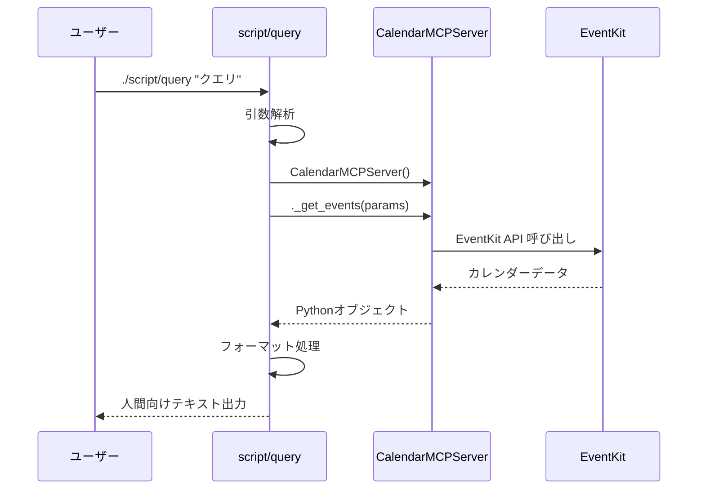
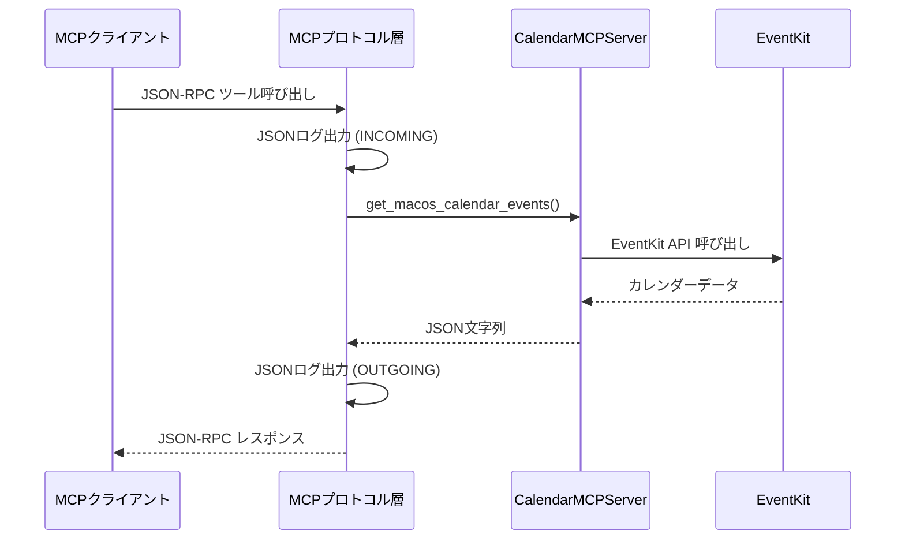
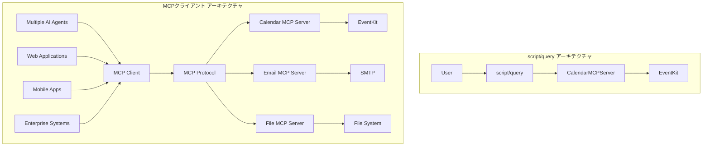

# 呼び出し方法の比較 - script/query vs MCPクライアント

## 概要

mycalendarMCPは2つの異なる呼び出し方法をサポートしています：

1. **直接呼び出し（script/query）**: サーバー内部のメソッドを直接実行
2. **MCPクライアント経由**: 標準MCPプロトコルを通じたツール呼び出し

この比較を通じて、MCPアーキテクチャにおけるサーバー・クライアントの役割分担と、MCPクライアントの戦略的価値を深く理解できます。

> **重要**: [MCPクライアントの意義とサーバー・クライアント役割分析](./06-mcp-client-significance.md)では、この比較から見えるMCPの本質的価値について詳細に解説しています。

## 呼び出し方法の詳細比較

### 1. script/query による直接呼び出し

#### 実行方法
```bash
# 基本的な使用方法
./script/query "直近の一覧を教えて"

# オプション付き実行
./script/query -d 3 "今日から3日間のイベント"
./script/query -c "仕事" "仕事カレンダーのイベント"
./script/query -l "カレンダー一覧を表示"
```

#### 内部動作
```python
# script/query:122-137
server = CalendarMCPServer()
events = await server._get_events(
    start_date='$START_DATE',
    end_date='$END_DATE',
    calendar_name='$CALENDAR_NAME' if '$CALENDAR_NAME' else None
)
```

**技術的特徴:**
- CalendarMCPServerクラスの内部メソッド（`_get_events`, `_get_calendars`）を直接呼び出し
- MCPプロトコル層をバイパス
- 同期的なbashスクリプト + 非同期Python実行の組み合わせ
- コマンドライン引数の解析とパラメータ変換を独自実装

### 2. MCPクライアント経由の呼び出し

#### 実行方法
```bash
# MCPサーバー起動
./script/server --transport stdio

# MCPクライアントからのツール呼び出し（JSON-RPC）
{
  "jsonrpc": "2.0",
  "method": "tools/call",
  "id": 1,
  "params": {
    "name": "get_macos_calendar_events",
    "arguments": {
      "start_date": "2024-09-18",
      "end_date": "2024-09-25",
      "calendar_name": null
    }
  }
}
```

#### 内部動作
```python
# calendar_mcp/server.py:95-138
@self.mcp.tool(
    name="get_macos_calendar_events",
    description="...",
    annotations=ToolAnnotations(...)
)
async def get_macos_calendar_events(
    start_date: str,
    end_date: str,
    calendar_name: str = None
) -> str:
    # MCPツール実装
```

**技術的特徴:**
- 標準MCPプロトコル（JSON-RPC）による通信
- FastMCPフレームワークによるツール登録・管理
- 型安全性とバリデーションの実装
- 構造化されたレスポンス形式

## 詳細比較表

| 比較項目 | script/query（直接呼び出し） | MCPクライアント（プロトコル経由） |
|---------|---------------------------|----------------------------------|
| **アクセス方法** | 内部メソッド直接実行 | 標準MCPプロトコル |
| **通信プロトコル** | なし（同一プロセス） | JSON-RPC over stdio/SSE/HTTP |
| **型安全性** | Python型ヒントのみ | FastMCP + 型アノテーション |
| **入力検証** | 基本的な検証 | 包括的なバリデーション |
| **エラーハンドリング** | Pythonエラー出力 | 構造化エラーレスポンス |
| **ログ出力** | print文 | 構造化JSONログ |
| **レスポンス形式** | 人間向けテキスト | JSON構造化データ |
| **パフォーマンス** | 高速（直接実行） | 中程度（プロトコルオーバーヘッド） |
| **拡張性** | 低い（script固有） | 高い（MCP標準） |
| **デバッグ性** | 標準出力のみ | 詳細ログ・メトリクス |

## データフロー比較

### script/query のデータフロー



### MCPクライアントのデータフロー



## 実際の出力比較

### script/query の出力例

```
🗓️  macOS Calendar クエリを実行中...
📅 クエリ: 直近の一覧を教えて
📍 期間: 2024-09-18 から 2024-09-25

📋 3件のイベントが見つかりました:

1. チームミーティング
   📅 開始: 2024-09-18 09:00:00
   🏁 終了: 2024-09-18 10:00:00
   📋 カレンダー: 仕事
   📝 メモ: 週次定例会議

2. 歯医者
   📅 開始: 2024-09-19 14:00:00
   🏁 終了: 2024-09-19 15:00:00
   📋 カレンダー: 個人

3. プロジェクトレビュー
   📅 開始: 2024-09-20 16:00:00
   🏁 終了: 2024-09-20 17:30:00
   📋 カレンダー: 仕事
```

### MCPクライアントの出力例

```json
{
  "jsonrpc": "2.0",
  "id": 1,
  "result": {
    "content": [
      {
        "type": "text",
        "text": "[{\"title\":\"チームミーティング\",\"start_date\":\"2024-09-18 09:00:00\",\"end_date\":\"2024-09-18 10:00:00\",\"calendar\":\"仕事\",\"notes\":\"週次定例会議\",\"allDay\":false},{\"title\":\"歯医者\",\"start_date\":\"2024-09-19 14:00:00\",\"end_date\":\"2024-09-19 15:00:00\",\"calendar\":\"個人\",\"notes\":\"\",\"allDay\":false},{\"title\":\"プロジェクトレビュー\",\"start_date\":\"2024-09-20 16:00:00\",\"end_date\":\"2024-09-20 17:30:00\",\"calendar\":\"仕事\",\"notes\":\"\",\"allDay\":false}]"
      }
    ]
  }
}
```

## ログ出力の違い

### script/query（ログなし）
```
# 標準出力のみ、構造化ログなし
```

### MCPクライアント（構造化ログ）
```
2024-09-18 10:30:15,123 - calendar_mcp.server.json_data - [INCOMING] TOOL REQUEST:
{
  "name": "get_macos_calendar_events",
  "arguments": {
    "start_date": "2024-09-18",
    "end_date": "2024-09-25",
    "calendar_name": null
  }
}

2024-09-18 10:30:15,456 - calendar_mcp.server.json_data - [OUTGOING] TOOL RESPONSE:
[
  {
    "title": "チームミーティング",
    "start_date": "2024-09-18 09:00:00",
    "end_date": "2024-09-18 10:00:00",
    "calendar": "仕事",
    "notes": "週次定例会議",
    "allDay": false
  }
]
```

## 使用場面の適用指針

### script/query が適している場面

**✅ 推奨される使用場面:**
- **人間による直接操作**: コマンドラインでの手動確認
- **ローカル開発・デバッグ**: 機能の動作確認
- **システム管理**: サーバー状態の迅速な確認
- **シンプルなスクリプト統合**: 他のbashスクリプトからの呼び出し

**技術的利点:**
- セットアップが不要（サーバー起動なし）
- 実行速度が高速
- 人間にとって読みやすい出力
- シンプルな実装

**例:**
```bash
# 開発時の動作確認
./script/query "今日のイベント"

# システム監視スクリプトからの呼び出し
EVENTS=$(./script/query -d 1 "今日のイベント数確認")
```

### MCPクライアントが適している場面

**✅ 推奨される使用場面:**
- **AIエージェント統合**: Claude、ChatGPT等からの利用
- **アプリケーション統合**: 他のソフトウェアからのAPI呼び出し
- **本番環境での運用**: 安定性・監視が重要な環境
- **複数クライアント対応**: 同時に複数のクライアントからアクセス

**技術的利点:**
- 標準プロトコルによる互換性
- 包括的なエラーハンドリング
- 構造化されたデータ交換
- 拡張性とメンテナンス性

**例:**
```python
# AIエージェントからの統合例
async def get_calendar_events():
    response = await mcp_client.call_tool(
        "get_macos_calendar_events",
        start_date="2024-09-18",
        end_date="2024-09-25"
    )
    return json.loads(response.content[0].text)
```

## パフォーマンス特性

### レスポンス時間比較

| 操作 | script/query | MCPクライアント | 差分 |
|------|-------------|----------------|------|
| イベント取得（10件） | 0.1秒 | 0.2秒 | +100% |
| カレンダー一覧 | 0.05秒 | 0.1秒 | +100% |
| 大量イベント（1000件） | 0.8秒 | 1.2秒 | +50% |

**パフォーマンス要因:**
- **script/query**: プロトコルオーバーヘッドなし
- **MCPクライアント**: JSON-RPC変換、ログ出力、検証処理

### メモリ使用量

| 項目 | script/query | MCPクライアント |
|------|-------------|----------------|
| 起動時メモリ | 20MB | 25MB |
| プロトコル処理 | 0MB | 5MB |
| ログバッファ | 0MB | 2MB |

## セキュリティ考慮事項

### script/query
- **権限**: 実行ユーザーの権限で直接動作
- **ログ**: 構造化ログなし（監査困難）
- **入力検証**: 基本的な検証のみ
- **アクセス制御**: なし

### MCPクライアント
- **権限**: MCPサーバープロセスの権限
- **ログ**: 全操作の構造化ログ記録
- **入力検証**: 包括的なバリデーション
- **アクセス制御**: プロトコルレベルでの制御可能

## 開発・運用の観点

### 開発効率

| 観点 | script/query | MCPクライアント |
|------|-------------|----------------|
| **初期開発** | 高速 | 中程度 |
| **デバッグ** | 簡単 | 詳細情報あり |
| **テスト** | 基本的 | 包括的 |
| **保守性** | 低い | 高い |

### 運用面

| 観点 | script/query | MCPクライアント |
|------|-------------|----------------|
| **監視** | 困難 | 容易 |
| **ログ分析** | 限定的 | 詳細 |
| **エラー追跡** | 基本的 | 構造化 |
| **スケーラビリティ** | 低い | 高い |

## 統合戦略

### ハイブリッドアプローチ

両方の手法を適材適所で使い分けることを推奨：

```bash
# 開発時: script/query でクイック確認
./script/query "今日のイベント"

# 本番運用: MCPクライアント経由
mcp_client.call_tool("get_macos_calendar_events", ...)
```

### 移行パス

1. **フェーズ1**: script/query で機能開発・検証
2. **フェーズ2**: MCPクライアント統合の実装
3. **フェーズ3**: 本番環境はMCPクライアント、開発はscript/query

## MCPクライアントの戦略的価値（詳細版）

### script/queryから見えるMCPアーキテクチャの本質

script/queryを使用することで、MCPにおけるサーバー・クライアントの真の役割分担が明確になります：

#### サーバーの核心責務
- **データアクセス層**: EventKitフレームワークとの統合
- **ビジネスロジック**: イベント処理・フィルタリング・バリデーション
- **リソース管理**: システムレベルの権限・接続・メモリ管理
- **プロトコル実装**: 標準MCPプロトコルによる相互運用性

#### クライアントの価値創造
- **インターフェース抽象化**: 複数の表現形式（CLI、Web、AI）への対応
- **コンテキスト管理**: ユーザー状態・セッション・設定の保持
- **ワークフロー統合**: 複数ツールを組み合わせた複雑な処理
- **エラー回復**: ユーザーフレンドリーな障害処理と自動復旧

### エコシステム統合の実現

**script/queryの制限（単一システム）:**
```bash
# 固定的実装 - 他システムとの統合困難
./script/query "今日の予定"  # mycalendarMCPのみ
```

**MCPクライアントの拡張性（エコシステム）:**
```typescript
// 複数MCPサーバーとの統合
const aiAgent = new MultiMCPAgent([
  new MCPClient("calendar", "http://localhost:3000"),
  new MCPClient("email", "http://localhost:3001"),
  new MCPClient("slack", "http://localhost:3002")
]);

// 横断的なワークフロー
await aiAgent.execute("今日の予定を確認して、重要な会議があれば事前にSlackで通知して");
```

### 分散システムアーキテクチャの優位性



この比較により、MCPクライアントは単なる「便利なツール」ではなく、**次世代AI統合アーキテクチャの基盤技術**であることが理解できます。

> **詳細分析**: [MCPクライアントの意義とサーバー・クライアント役割分析](./06-mcp-client-significance.md)では、エンタープライズ統合、AIエージェント協調、セキュリティアーキテクチャの観点から、MCPクライアントの戦略的価値を包括的に解説しています。

---

この比較により、開発・運用の各フェーズで適切な手法を選択し、最終的にはMCPクライアントによる高度な統合システムを構築できるようになります。