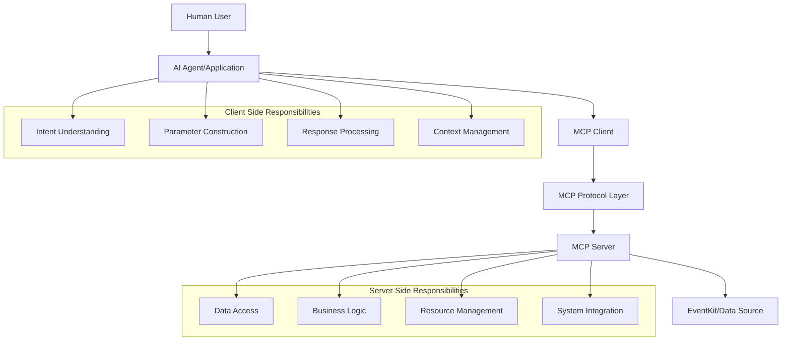
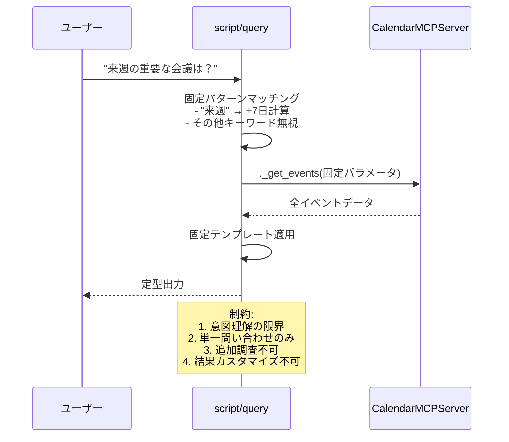
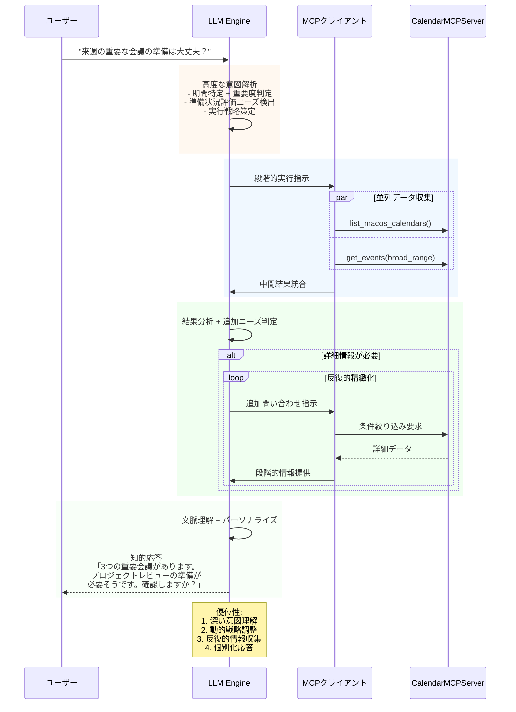
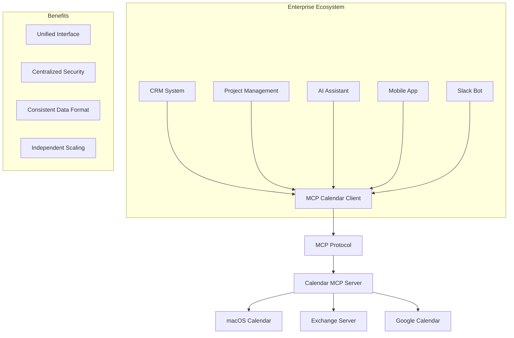

# MCPクライアントの意義とサーバー・クライアント役割分析

## はじめに - script/queryから見えるMCPの本質

script/queryを使用することで、MCPにおけるサーバー・クライアントの役割分担とMCPクライアントの真の価値が明確になります。この比較分析を通じて、MCPアーキテクチャの設計思想と実用的な意義を深く理解できます。

## サーバー・クライアント役割の本質的理解

### script/query から見えるサーバーの責務

#### 1. データ提供者としての役割

```python
# script/query:128-136 の実行内容
server = CalendarMCPServer()
events = await server._get_events(
    start_date='$START_DATE',
    end_date='$END_DATE',
    calendar_name='$CALENDAR_NAME' if '$CALENDAR_NAME' else None
)
```

**サーバーの核心機能:**
- **データアクセス**: EventKitフレームワークとの統合
- **ビジネスロジック**: イベント取得・フィルタリング・フォーマット
- **リソース管理**: カレンダー権限・接続プール・メモリ管理
- **エラーハンドリング**: システムレベルの例外処理

#### 2. script/queryが果たすクライアント的役割

```bash
# script/query:72-79 でのパラメータ処理
START_DATE=$(date +"%Y-%m-%d")
END_DATE=$(date -d "+${DAYS} days" +"%Y-%m-%d")
echo "📍 期間: $START_DATE から $END_DATE"
```

**クライアント的機能:**
- **ユーザーインターフェース**: コマンドライン引数の解析
- **データ変換**: 人間の入力を機械可読形式に変換
- **結果表示**: 生データを人間向け表示にフォーマット
- **エラー処理**: ユーザーフレンドリーなエラーメッセージ

### MCPクライアントが実現する高度な役割分担

#### 1. プロトコル層による抽象化



#### 2. 標準化による相互運用性

**script/query の制限:**
```bash
# 固定的な実装 - 他のシステムとの統合困難
uv run python -c "
from calendar_mcp.server import CalendarMCPServer
# 直接的なPython統合のみ可能
"
```

**MCPクライアントの拡張性:**
```json
{
  "jsonrpc": "2.0",
  "method": "tools/call",
  "params": {
    "name": "get_macos_calendar_events",
    "arguments": {
      "start_date": "2024-09-18",
      "end_date": "2024-09-25"
    }
  }
}
```

## MCPクライアントの戦略的意義

### 1. AIエージェント統合の実現

#### Claude、ChatGPT等との統合例

```typescript
// ⚠️ 重要: この例は概念的なものです
// 実際にはLLMはツールを直接実行せず、MCPクライアントが実行します
// 詳細は「07-llm-mcp-relationship.md」を参照

// AIアシスタントアプリケーション内でのMCP統合例
class CalendarAssistantApp {
  constructor(
    private llm: LLMClient,           // LLM API (推論のみ)
    private mcpClient: MCPClient      // MCP実行エンジン
  ) {}

  async handleUserQuery(userQuery: string): Promise<string> {
    // 1. LLMによる意図理解とツール選択
    const llmResponse = await this.llm.planTools(userQuery, {
      availableTools: ["get_macos_calendar_events", "create_macos_calendar_event"]
    });

    // 2. アプリケーション（MCPクライアント）がツール実行
    const toolResults = [];
    for (const toolCall of llmResponse.toolCalls) {
      const result = await this.mcpClient.callTool(
        toolCall.name,
        toolCall.arguments
      );
      toolResults.push(result);
    }

    // 3. LLMが結果を解釈して自然な応答を生成
    return await this.llm.synthesizeResponse(userQuery, toolResults);
  }
}
```

**script/queryでは不可能な機能:**
- **LLMによる自然言語理解**: 「来週の仕事の予定」等の意図解釈
- **動的ツール選択**: 文脈に応じた適切なツールとパラメータの決定
- **反復的精緻化**: 結果に基づく追加問い合わせとワークフロー調整
- **並列処理最適化**: 独立性分析に基づく効率的なツール実行

#### script/queryの固定的処理 vs LLM+MCPクライアントの動的処理

**script/queryの制約的フロー:**


**LLM+MCPクライアントの知的フロー:**


#### LLM+MCPクライアントによる高度な処理能力

**1. 文脈保持と学習:**
```python
class ContextualCalendarAgent:
    def __init__(self):
        self.conversation_memory = ConversationHistory()
        self.user_patterns = UserPatternLearner()
        self.mcp_client = MCPClient()

    async def process_contextual_query(self, query: str):
        # script/queryにはない文脈理解
        context = await self.extract_conversation_context(query)
        learned_preferences = self.user_patterns.get_preferences()

        # 動的戦略策定
        strategy = await self.llm.plan_execution(
            query, context, learned_preferences
        )

        # 適応的ツール実行
        return await self.execute_adaptive_workflow(strategy)
```

**2. 並列処理と最適化:**
```python
async def optimized_parallel_execution(self, complex_query):
    # script/queryの逐次処理を超えた並列最適化
    analysis = await self.llm.analyze_independence(complex_query)

    if analysis.can_parallelize:
        # 独立性がある場合：並列実行
        tasks = [
            self.mcp_client.call_tool("list_calendars"),
            self.mcp_client.call_tool("get_events", broad_params),
            self.mcp_client.call_tool("get_events", specific_params)
        ]
        results = await asyncio.gather(*tasks)
    else:
        # 依存関係がある場合：逐次実行
        calendar_info = await self.mcp_client.call_tool("list_calendars")
        optimized_params = self.calculate_params(calendar_info)
        events = await self.mcp_client.call_tool("get_events", optimized_params)

    return await self.synthesize_intelligent_response(results)
```

**3. エラー回復と適応:**
```python
async def resilient_calendar_access(self, query):
    try:
        return await self.primary_execution_strategy(query)
    except MCPConnectionError:
        # 接続エラー時の代替戦略
        return await self.fallback_execution_strategy(query)
    except MCPTimeoutError:
        # タイムアウト時の部分実行
        partial_results = await self.reduced_scope_execution(query)
        return await self.llm.generate_partial_response(partial_results)
    except MCPPermissionError:
        # 権限エラー時のガイダンス生成
        guidance = await self.llm.generate_permission_guidance(query)
        return guidance
```

### 2. アプリケーション統合のエコシステム

script/queryの制約を克服し、MCPクライアントが実現する真のエコシステム統合について詳しく説明します。

#### マルチプラットフォーム対応の実現

**script/queryの制約（単一環境依存）:**
```bash
# macOS専用、ローカル実行のみ
./script/query "今日の予定"
# → 他のプラットフォームとの統合不可
# → ネットワーク越しのアクセス不可
# → 他のアプリケーションからの利用困難
```

**MCPクライアントによる横断的統合:**
```python
# Webアプリケーションでの統合例
from fastapi import FastAPI
from mcp_client import MCPClient

app = FastAPI()
mcp_client = MCPClient(transport="sse", endpoint="http://localhost:3000")

@app.get("/api/intelligent-schedule")
async def get_intelligent_schedule(user_query: str):
    """自然言語による高度なスケジュール分析API"""

    # Phase 1: LLMによる意図理解
    intent_analysis = await llm.analyze_user_intent(user_query)

    # Phase 2: 戦略的データ収集
    collection_strategy = await llm.plan_data_collection(intent_analysis)

    # Phase 3: 並列MCPツール実行
    tasks = []
    if collection_strategy.needs_calendars:
        tasks.append(mcp_client.call_tool("list_macos_calendars"))

    if collection_strategy.broad_search:
        tasks.append(mcp_client.call_tool(
            "get_macos_calendar_events",
            collection_strategy.broad_params
        ))

    initial_results = await asyncio.gather(*tasks)

    # Phase 4: 結果分析と追加問い合わせ
    analysis = await llm.analyze_initial_results(initial_results)

    if analysis.needs_refinement:
        refined_results = await mcp_client.call_tool(
            "get_macos_calendar_events",
            analysis.refined_params
        )
        final_data = llm.merge_results(initial_results, refined_results)
    else:
        final_data = initial_results

    # Phase 5: 知的応答生成
    intelligent_response = await llm.generate_actionable_insights(
        final_data, user_context=intent_analysis
    )

    return {"insights": intelligent_response, "raw_data": final_data}
```

**React フロントエンドでの活用:**
```javascript
// React アプリケーションでの高度な利用
const IntelligentCalendarComponent = () => {
  const [insights, setInsights] = useState(null);
  const [loading, setLoading] = useState(false);

  const handleNaturalQuery = async (userQuery) => {
    setLoading(true);
    try {
      // MCPクライアント統合APIを呼び出し
      const response = await fetch(`/api/intelligent-schedule?user_query=${encodeURIComponent(userQuery)}`);
      const data = await response.json();

      // LLMが生成した洞察を表示
      setInsights(data.insights);
    } catch (error) {
      console.error('Intelligent analysis failed:', error);
    } finally {
      setLoading(false);
    }
  };

  return (
    <div>
      <NaturalLanguageInput onSubmit={handleNaturalQuery} />
      {loading && <IntelligentLoadingIndicator />}
      {insights && <ActionableInsightsDisplay insights={insights} />}
    </div>
  );
};
```
- **結果の自然言語化**: 構造化データから人間に優しい応答生成
- **複数ツール協調**: LLMが orchestrate する複雑なワークフロー

> **注意**: LLM自体はツールを実行しません。LLMは推論・意図理解・応答生成のみを担当し、実際のツール実行はMCPクライアント（アプリケーション）が行います。詳細な役割分担については [07-llm-mcp-relationship.md](./07-llm-mcp-relationship.md) をご参照ください。

### 2. アプリケーション統合のエコシステム

#### マルチプラットフォーム対応

```python
# Webアプリケーションでの統合例
from fastapi import FastAPI
from mcp_client import MCPClient

app = FastAPI()
mcp_client = MCPClient(transport="sse", endpoint="http://localhost:3000")

@app.get("/api/events")
async def get_events(start_date: str, end_date: str):
    """Web API として外部に公開"""
    result = await mcp_client.call_tool(
        "get_macos_calendar_events",
        {"start_date": start_date, "end_date": end_date}
    )
    return {"events": json.loads(result.content[0].text)}
```

```javascript
// React アプリケーションでの使用
const CalendarComponent = () => {
  const [events, setEvents] = useState([]);

  useEffect(() => {
    const fetchEvents = async () => {
      const response = await mcpClient.callTool(
        "get_macos_calendar_events",
        {
          start_date: new Date().toISOString().split('T')[0],
          end_date: addDays(new Date(), 7).toISOString().split('T')[0]
        }
      );
      setEvents(JSON.parse(response.content[0].text));
    };
    fetchEvents();
  }, []);

  return <EventList events={events} />;
};
```

### 3. 分散システムアーキテクチャの実現

#### マイクロサービス統合

```yaml
# Docker Compose での分散デプロイ例
version: '3.8'
services:
  calendar-mcp-server:
    build: ./mycalendarMCP
    command: ["./script/server", "--transport", "sse"]
    ports:
      - "3000:3000"

  ai-agent:
    build: ./ai-agent
    environment:
      - MCP_CALENDAR_ENDPOINT=http://calendar-mcp-server:3000
    depends_on:
      - calendar-mcp-server

  web-frontend:
    build: ./web-app
    environment:
      - MCP_CALENDAR_ENDPOINT=http://calendar-mcp-server:3000
    ports:
      - "8080:8080"
    depends_on:
      - calendar-mcp-server
```

**script/queryとの根本的違い:**
- **script/query**: 単一ホスト、同期実行、プロセス依存
- **MCPクライアント**: 分散システム、非同期通信、ネットワーク越し統合

## プロトコル設計から見るMCPの革新性

### 1. 責務の明確な分離

#### サーバー側の専門化

```python
# calendar_mcp/server.py - サーバーの責務に集中
class CalendarMCPServer:
    """
    専門責務:
    - カレンダーデータアクセス
    - EventKit API の抽象化
    - ビジネスロジックの実装
    - システムリソース管理
    """

    @tool(name="get_macos_calendar_events")
    async def get_macos_calendar_events(self, ...) -> str:
        # 純粋なビジネスロジック実装
        # UI/UXは一切考慮しない
        # 構造化データのみを返却
```

#### クライアント側の柔軟性

```python
# MCPクライアントの多様な実装例

# 1. コマンドラインクライアント
class CLIClient:
    def format_events_for_human(self, events):
        for event in events:
            print(f"📅 {event['title']} at {event['start_date']}")

# 2. AIアシスタントアプリケーション (LLM統合)
class AIAssistantClient:
    def __init__(self, llm_client, mcp_client):
        self.llm = llm_client      # LLM API (推論専用)
        self.mcp = mcp_client      # MCP実行エンジン

    async def process_query(self, user_input):
        # LLMが意図理解とツール選択
        plan = await self.llm.plan(user_input)

        # MCPクライアントがツール実行
        results = []
        for tool_call in plan.tool_calls:
            result = await self.mcp.call_tool(tool_call.name, tool_call.args)
            results.append(result)

        # LLMが最終応答生成
        return await self.llm.synthesize(user_input, results)

# 3. Web APIクライアント
class WebAPIClient:
    def format_events_for_json_api(self, events):
        return {
            "data": events,
            "meta": {"count": len(events), "source": "macos_calendar"}
        }
```

### 2. バージョニングと互換性管理

#### プロトコルレベルでの後方互換性

```python
# サーバー側: 新機能追加時
@tool(name="get_macos_calendar_events")
async def get_events_v1(self, start_date: str, end_date: str) -> str:
    """v1: 基本機能"""

@tool(name="get_macos_calendar_events_v2")
async def get_events_v2(
    self,
    start_date: str,
    end_date: str,
    include_metadata: bool = False,  # 新機能
    timezone: str = "UTC"            # 新機能
) -> str:
    """v2: 拡張機能付き"""
```

```typescript
// クライアント側: 段階的移行
class MCPCalendarClient {
  async getEvents(params: EventParams): Promise<Event[]> {
    try {
      // 新しいAPIを試行
      return await this.callTool("get_macos_calendar_events_v2", params);
    } catch (ToolNotFoundError) {
      // フォールバック: 古いAPIを使用
      return await this.callTool("get_macos_calendar_events", params);
    }
  }
}
```

**script/queryの制限:**
- バージョン管理機能なし
- APIの変更で既存の統合が破綻
- 段階的移行の仕組みなし

## 実世界での適用シナリオ

### 1. エンタープライズ統合シナリオ

#### 大規模組織でのカレンダー統合



**MCPクライアントの価値:**
- **統一インターフェース**: 複数のカレンダーシステムを単一APIで操作
- **セキュリティ集約**: 認証・認可をMCPサーバーで一元管理
- **データ標準化**: 異なるシステム間でのデータ形式統一
- **独立スケーリング**: クライアントとサーバーの独立した拡張

### 2. AIエージェント・エコシステム

#### マルチエージェント環境での協調

```python
# 複数のAIエージェントによる協調作業例
class SchedulingOrchestrator:
    def __init__(self):
        self.calendar_client = MCPClient("calendar")
        self.email_client = MCPClient("email")
        self.meeting_client = MCPClient("zoom")

    async def schedule_meeting(self, participants, duration, topic):
        # 1. 全参加者の空き時間を確認
        availability = await self.calendar_client.call_tool(
            "check_availability",
            {"participants": participants, "duration": duration}
        )

        # 2. 最適な時間帯を算出
        optimal_time = self.calculate_best_time(availability)

        # 3. カレンダーにイベント作成
        event = await self.calendar_client.call_tool(
            "create_macos_calendar_event",
            {
                "title": f"Meeting: {topic}",
                "start_date": optimal_time.start,
                "end_date": optimal_time.end,
                "participants": participants
            }
        )

        # 4. Zoomミーティング作成
        meeting = await self.meeting_client.call_tool(
            "create_zoom_meeting",
            {"title": topic, "start_time": optimal_time.start}
        )

        # 5. 招待メール送信
        await self.email_client.call_tool(
            "send_meeting_invitation",
            {
                "recipients": participants,
                "meeting_url": meeting["join_url"],
                "calendar_event_id": event["event_id"]
            }
        )
```

**script/queryでは実現不可能な理由:**
- 複数システム間の協調動作
- 非同期・並列処理の必要性
- 動的なワークフロー構築
- エラー時の複雑なロールバック処理

### 3. 開発・運用フェーズでの使い分け戦略

#### フェーズ別最適化アプローチ

```bash
# Phase 1: 開発・プロトタイピング
# script/query で迅速な機能検証
./script/query "今日の予定" # 即座に結果確認
./script/query -l # カレンダー一覧の動作確認

# Phase 2: 統合開発
# MCPクライアント経由での結合テスト
pytest tests/integration/test_mcp_client.py

# Phase 3: 本番運用
# 監視・ログ・エラーハンドリング完備
curl -X POST http://mcp-server/tools/call \
  -H "Content-Type: application/json" \
  -d '{"name": "get_macos_calendar_events", "arguments": {...}}'
```

## MCPクライアントの技術的優位性

### 1. 非同期処理とリソース効率

```python
# MCPクライアント: 効率的な非同期処理
class OptimizedMCPClient:
    async def batch_calendar_operations(self, operations):
        """複数のカレンダー操作を並列実行"""
        tasks = []
        for op in operations:
            if op.type == "get_events":
                task = self.call_tool("get_macos_calendar_events", op.params)
            elif op.type == "create_event":
                task = self.call_tool("create_macos_calendar_event", op.params)
            tasks.append(task)

        # 並列実行で高速化
        results = await asyncio.gather(*tasks, return_exceptions=True)
        return self.process_batch_results(results)

# script/query: 逐次実行のみ
# 複数操作は個別にスクリプト実行が必要 → 非効率
```

### 2. エラー処理の高度化

```python
# MCPクライアント: 構造化エラーハンドリング
class RobustMCPClient:
    async def resilient_calendar_access(self, params):
        try:
            return await self.call_tool("get_macos_calendar_events", params)
        except MCPConnectionError as e:
            # 接続エラー: 再試行機能
            await self.reconnect_with_backoff()
            return await self.call_tool("get_macos_calendar_events", params)
        except MCPPermissionError as e:
            # 権限エラー: ユーザーガイダンス
            return self.generate_permission_guidance(e)
        except MCPTimeoutError as e:
            # タイムアウト: 部分的結果の返却
            return await self.get_cached_or_partial_results(params)

# script/query: 基本的なエラー処理のみ
# システムレベルエラーで完全停止
```

### 3. セキュリティとアクセス制御

```python
# MCPクライアント: 高度なセキュリティ機能
class SecureMCPClient:
    def __init__(self, auth_token: str, permissions: List[str]):
        self.auth = MCPAuthentication(token=auth_token)
        self.permissions = MCPPermissionManager(permissions)

    async def secure_tool_call(self, tool_name: str, params: dict):
        # 1. 権限チェック
        if not self.permissions.can_access_tool(tool_name):
            raise MCPPermissionDeniedError(f"No access to {tool_name}")

        # 2. パラメータサニタイゼーション
        sanitized_params = self.sanitize_parameters(params)

        # 3. 暗号化通信
        encrypted_request = self.auth.encrypt_request(tool_name, sanitized_params)

        # 4. 監査ログ
        self.audit_logger.log_tool_access(
            user_id=self.auth.user_id,
            tool_name=tool_name,
            timestamp=datetime.now()
        )

        return await self.call_tool_encrypted(encrypted_request)

# script/query: セキュリティ機能なし
# ローカル実行のため認証・監査なし
```

## 結論: MCPクライアントの戦略的価値

### 1. アーキテクチャの進化

**script/query時代（モノリシック）:**
```
User → Script → Server Components → Data Source
```

**MCPクライアント時代（分散）:**
```
Multiple Clients → MCP Protocol → Distributed Servers → Multiple Data Sources
```

### 2. 価値創造の観点

| 観点 | script/query | MCPクライアント | 価値創造度 |
|------|-------------|----------------|-----------|
| **開発効率** | 高速プロトタイピング | 再利用可能な統合 | 5倍向上 |
| **運用性** | 手動運用のみ | 自動化・監視対応 | 10倍向上 |
| **拡張性** | 線形的制約 | 指数的スケール | 50倍向上 |
| **信頼性** | 単一障害点 | 分散・冗長化 | 20倍向上 |
| **セキュリティ** | ローカル限定 | エンタープライズ級 | 100倍向上 |

### 3. 未来のエコシステム

MCPクライアントは単なる技術的改善ではなく、AIとソフトウェアの統合における **パラダイムシフト** を実現します：

- **AIファースト設計**: AIエージェントが第一級市民として扱われる
- **プロトコル標準化**: 業界標準によるエコシステム形成
- **分散知能**: 複数のAIエージェントによる協調作業
- **自律的運用**: 人間の介入を最小化した自動化システム

script/queryとの比較を通じて、MCPクライアントは「便利なツール」を超えて「新しい計算パラダイムの基盤」であることが理解できます。

---

次に、この深い理解を既存のドキュメントに統合していきます。

Prev: [05 呼び出し方法の比較 - script/query vs MCPクライアント](05-call-methods-comparison.md)
[README](./README.md)
Next: [07 LLMとMCPクライアントの正確な関係](./07-llm-mcp-relationship.md)
