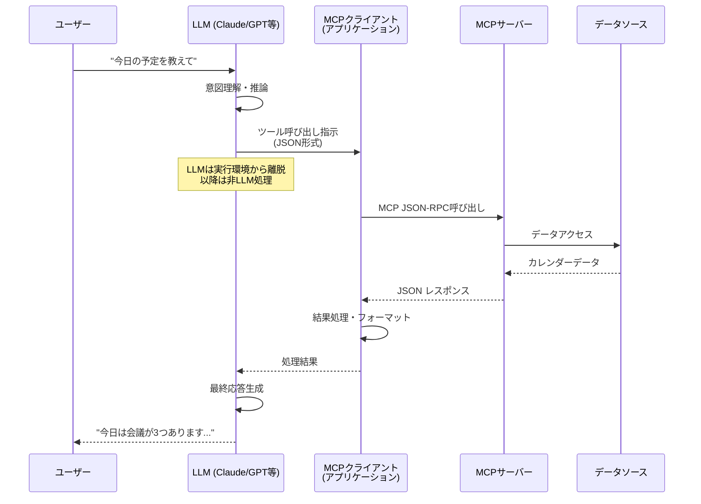
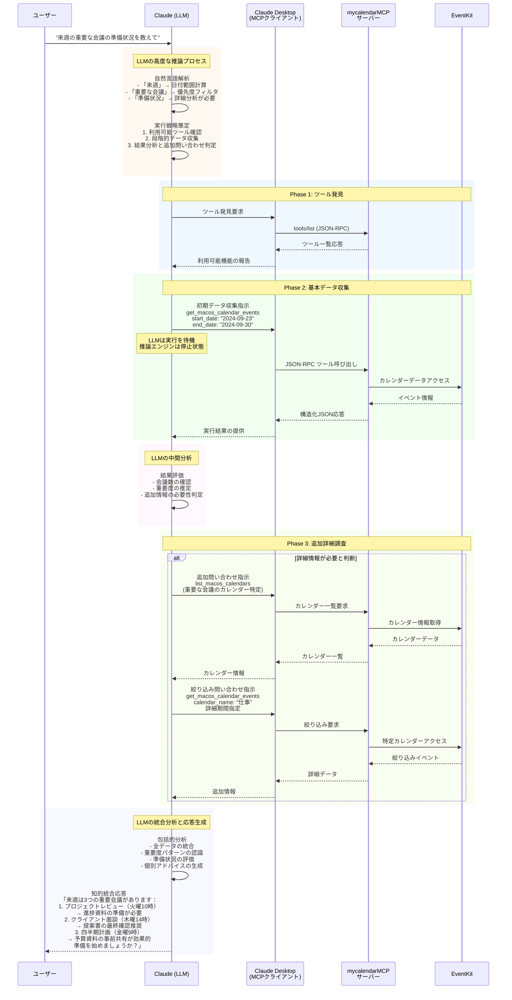
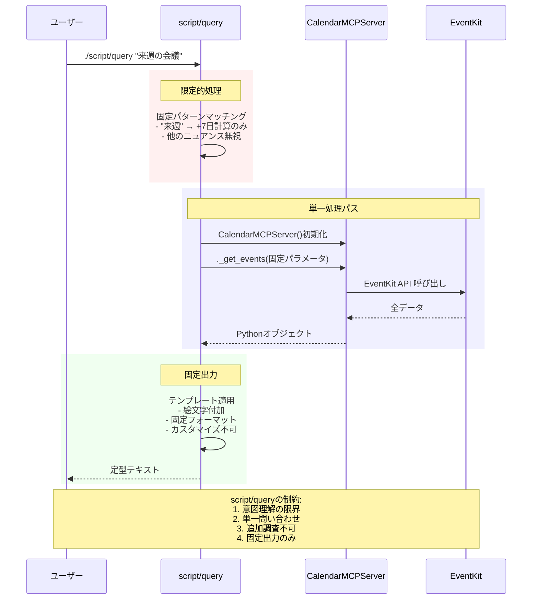
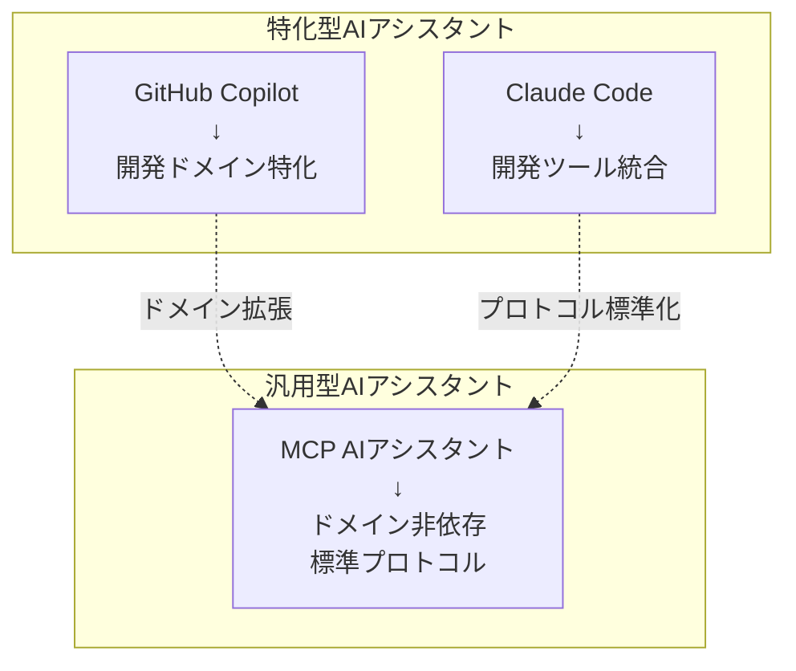

# LLMとMCPクライアントの正確な関係

- [はじめに - MCPにおけるLLMの役割の誤解](#はじめに---mcpにおけるllmの役割の誤解)
- [正確なMCPアーキテクチャ](#正確なmcpアーキテクチャ)
  - [1. LLMの実際の役割](#1-llmの実際の役割)
  - [2. script/queryとの対比](#2-scriptqueryとの対比)
- [実際のMCPクライアント実装例](#実際のmcpクライアント実装例)
  - [1. Claude Desktop での実際の動作](#1-claude-desktop-での実際の動作)
  - [2. カスタムMCPクライアントの実装](#2-カスタムmcpクライアントの実装)
- [LLMの制約と分離の理由](#llmの制約と分離の理由)
  - [1. LLMがツールを直接実行できない技術的理由](#1-llmがツールを直接実行できない技術的理由)
  - [2. 責任分離の設計思想](#2-責任分離の設計思想)
- [実世界での動作例](#実世界での動作例)
  - [1. Claude Desktop + mycalendarMCP の詳細フロー](#1-claude-desktop--mycalendarmcp-の詳細フロー)
  - [2. なぜLLMとMCPクライアントの複雑な統合が必要か](#2-なぜllmとmcpクライアントの複雑な統合が必要か)
  - [3. 処理時間と価値の比較](#3-処理時間と価値の比較)
- [開発者への実装ガイダンス](#開発者への実装ガイダンス)
  - [1. LLM統合時の注意点](#1-llm統合時の注意点)
  - [2. エラーハンドリングの分離](#2-エラーハンドリングの分離)
- [結論: 正確な理解の重要性](#結論-正確な理解の重要性)
- [他のAIアシスタントとの比較](#他のaiアシスタントとの比較)

## はじめに - MCPにおけるLLMの役割の誤解

MCPクライアントについて語る際、「LLMが動的に実行している」という誤解が生じがちです。実際には、**LLM自体はMCPツールを直接実行しない**のが正確な理解です。この章では、LLMとMCPクライアントの正確な関係と、実際のアーキテクチャを明確にします。

## 正確なMCPアーキテクチャ

### 1. LLMの実際の役割



**重要な点:**
- **LLMは推論・意図理解のみ**: ツール実行の判断と結果解釈
- **実際の実行はMCPクライアント**: LLMとは独立したプロセス
- **LLMは実行中に関与しない**: ツール呼び出し後はMCPクライアントが処理

### 2. script/queryとの対比

#### script/query: 直接実行モデル
```bash
# ユーザーが直接実行
./script/query "今日の予定"
# ↓ 人間が意図を事前に構造化済み
# ↓ スクリプトが直接サーバーメソッド呼び出し
```

#### LLM + MCPクライアント: 分離モデル
```json
// 1. LLMが意図を構造化
{
  "思考": "ユーザーは今日の予定を知りたがっている",
  "ツール": "get_macos_calendar_events",
  "パラメータ": {
    "start_date": "2024-09-19",
    "end_date": "2024-09-19"
  }
}

// 2. MCPクライアントが実行 (LLMは関与しない)
// 3. LLMが結果を解釈・応答生成
```

## 実際のMCPクライアント実装例

### 1. Claude Desktop での実際の動作

```typescript
// Claude Desktop (MCPクライアント) の内部処理例
class ClaudeDesktopMCPClient {
  async handleLLMToolRequest(toolCall: LLMToolCall): Promise<ToolResult> {
    // LLMからのツール呼び出し指示を受信
    const { name, arguments: args } = toolCall;

    try {
      // MCPサーバーへの実際の呼び出し (LLMは関与しない)
      const response = await this.mcpConnection.sendRequest({
        jsonrpc: "2.0",
        method: "tools/call",
        params: { name, arguments: args },
        id: this.generateId()
      });

      // 結果をLLMに返却
      return {
        content: response.result.content,
        isError: false
      };
    } catch (error) {
      // エラーもLLMに返却
      return {
        content: `Error: ${error.message}`,
        isError: true
      };
    }
  }
}
```

**重要な理解:**
- **LLMはツール呼び出しを「依頼」するだけ**
- **実際の実行はClaudeデスクトップアプリが担当**
- **LLMは結果を受け取って解釈・応答生成**

### 2. カスタムMCPクライアントの実装

```python
# カスタムAIアシスタントでのMCP統合例
class CustomAIAssistant:
    def __init__(self):
        self.llm = OpenAIClient()  # LLM API
        self.mcp_client = MCPClient()  # MCPクライアント

    async def process_user_query(self, user_input: str) -> str:
        # Phase 1: LLMによる意図理解・ツール選択
        llm_response = await self.llm.complete([
            {"role": "system", "content": "利用可能なツール: get_macos_calendar_events"},
            {"role": "user", "content": user_input}
        ], tools=self.get_available_tools())

        # Phase 2: LLMがツール呼び出しを決定した場合
        if llm_response.tool_calls:
            tool_results = []

            for tool_call in llm_response.tool_calls:
                # MCPクライアントが実際にツール実行 (LLMは関与しない)
                result = await self.execute_mcp_tool(
                    tool_call.function.name,
                    json.loads(tool_call.function.arguments)
                )
                tool_results.append(result)

            # Phase 3: LLMが結果を解釈して最終応答生成
            final_response = await self.llm.complete([
                {"role": "user", "content": user_input},
                {"role": "assistant", "content": "", "tool_calls": llm_response.tool_calls},
                {"role": "tool", "content": json.dumps(tool_results)}
            ])

            return final_response.content

    async def execute_mcp_tool(self, tool_name: str, args: dict) -> dict:
        """LLMとは独立したMCPツール実行"""
        try:
            response = await self.mcp_client.call_tool(tool_name, args)
            return {
                "success": True,
                "data": response.content[0].text
            }
        except Exception as e:
            return {
                "success": False,
                "error": str(e)
            }
```

## LLMの制約と分離の理由

### 1. LLMがツールを直接実行できない技術的理由

#### セキュリティ分離
```python
# ❌ LLMが直接実行する場合の危険性
def dangerous_llm_direct_execution():
    """
    LLMが直接システムにアクセスする場合:
    - 予期しないコマンド実行
    - セキュリティ境界の破綻
    - 監査証跡の欠如
    """
    llm_output = "rm -rf /"  # LLMの予期しない出力
    os.system(llm_output)    # 危険な直接実行

# ✅ MCP による安全な分離
class SafeMCPExecution:
    def execute_tool(self, tool_name: str, args: dict):
        # 1. ツール名の検証
        if tool_name not in self.allowed_tools:
            raise SecurityError("Unauthorized tool")

        # 2. パラメータの検証
        validated_args = self.validate_parameters(args)

        # 3. 権限チェック
        if not self.check_permissions(tool_name):
            raise PermissionError("Insufficient permissions")

        # 4. 安全な実行
        return self.execute_safely(tool_name, validated_args)
```

#### プロセス分離
```yaml
# Docker での分離例
version: '3.8'
services:
  llm-service:
    image: llm-runtime
    # LLMは推論のみ、システムアクセスなし
    networks:
      - llm-network
    volumes: []  # ファイルシステムアクセスなし

  mcp-client:
    image: mcp-client
    # MCPクライアントのみがシステムアクセス
    networks:
      - llm-network
      - mcp-network
    volumes:
      - /var/calendar:/data:ro

  mcp-server:
    image: mycalendar-mcp
    # MCPサーバーが実際のデータアクセス
    networks:
      - mcp-network
    volumes:
      - /Users/user/Library/Calendars:/calendars:ro
```

### 2. 責任分離の設計思想

#### LLMの責務（推論層）
- **自然言語理解**: ユーザー意図の解釈
- **文脈推論**: 過去の会話履歴からの判断
- **ツール選択**: 適切なツールとパラメータの決定
- **結果解釈**: ツール実行結果の人間向け変換

#### MCPクライアントの責務（実行層）
- **プロトコル処理**: JSON-RPC通信の管理
- **エラーハンドリング**: 接続エラー、タイムアウト処理
- **リソース管理**: 接続プール、キャッシュ管理
- **セキュリティ**: 認証、認可、監査ログ

#### MCPサーバーの責務（データ層）
- **データアクセス**: 実際のシステムリソースへのアクセス
- **ビジネスロジック**: ドメイン固有の処理
- **システム統合**: EventKit、ファイルシステム等との連携

## 実世界での動作例

### 1. Claude Desktop + mycalendarMCP の詳細フロー

実際のClaude DesktopとmycalendarMCPの連携は、LLMの推論、MCPクライアントの実行、サーバーの処理が段階的に組み合わされた複雑なプロセスです。

#### 完全な処理フロー



#### script/query との詳細比較

**script/queryの固定的処理:**


#### 処理の複雑性と知能性の比較

**処理ステップ数の比較:**

| 段階 | script/query | LLM+MCPクライアント |
|------|-------------|-------------------|
| **意図理解** | 1ステップ（固定） | 3-5ステップ（動的） |
| **データ収集** | 1回（固定範囲） | 1-4回（段階的） |
| **結果分析** | なし | 2-3ステップ |
| **追加問い合わせ** | なし | 0-3回（必要時） |
| **応答生成** | 1ステップ（固定） | 2-4ステップ（知的） |
| **合計** | **3ステップ** | **8-19ステップ** |

**並列処理の活用:**

```python
# script/query: 逐次処理のみ
def query_calendar():
    server = CalendarMCPServer()
    events = server._get_events(params)  # 単一呼び出し
    return format_output(events)         # 固定フォーマット

# LLM+MCPクライアント: 並列最適化
async def intelligent_calendar_query():
    # Phase 1: 並列データ収集
    calendar_task = mcp_client.call_tool("list_calendars")
    events_task = mcp_client.call_tool("get_events", broad_range)

    calendars, events = await asyncio.gather(calendar_task, events_task)

    # Phase 2: LLMによる分析
    analysis = await llm.analyze_calendar_data(calendars, events)

    # Phase 3: 必要に応じた追加問い合わせ
    if analysis.needs_detail:
        detailed_events = await mcp_client.call_tool(
            "get_events", analysis.refined_params
        )
        events = merge_and_enhance(events, detailed_events)

    # Phase 4: 知的応答生成
    return await llm.generate_contextual_response(events, user_context)
```

### 2. なぜLLMとMCPクライアントの複雑な統合が必要か

#### 単純なMCPサーバー呼び出しでは実現できない価値

**MCPサーバーのみの限界:**
```python
# 単純なMCPサーバー呼び出し
response = await mcp_server.get_events(
    start_date="2024-09-23",
    end_date="2024-09-30"
)
# → 全イベントの構造化データのみ
# → ユーザーが手動で重要性を判断必要
# → 準備状況の評価は不可能
```

**LLM+MCPクライアントが提供する付加価値:**
```python
# 知的な統合システム
class IntelligentCalendarSystem:
    async def analyze_meeting_preparation(self, user_query: str):
        # 1. 意図の深い理解
        intent = await self.llm.understand_complex_intent(user_query)

        # 2. 戦略的データ収集
        strategy = await self.llm.plan_data_collection(intent)

        # 3. 並列・段階的実行
        raw_data = await self.mcp_client.execute_strategy(strategy)

        # 4. 知的分析
        analysis = await self.llm.analyze_meeting_patterns(raw_data)

        # 5. 個別化された実用的アドバイス
        return await self.llm.generate_actionable_advice(analysis)
```

#### LLMとMCPクライアントの相乗効果

**LLMの認知機能:**
- 自然言語の深い理解
- 文脈とパターンの認識
- 戦略的思考と判断
- 個別化されたコミュニケーション

**MCPクライアントの実行機能:**
- 並列・逐次処理の最適化
- エラー回復と堅牢性
- 複数システムの統合
- プロトコルレベルの抽象化

### 3. 処理時間と価値の比較

| フェーズ | script/query | LLM + MCPクライアント | 付加価値 |
|---------|-------------|----------------------|---------|
| **意図理解** | 0ms (人間が事前実行) | 200ms (LLM推論) | 自然言語の深い理解 |
| **戦略策定** | 0ms (固定処理) | 50ms (動的計画) | 最適化された実行計画 |
| **ツール発見** | なし | 30ms (capabilities確認) | 動的ツール選択 |
| **データ収集** | 150ms (単一呼び出し) | 180ms (並列MCP呼び出し) | 効率的な並列処理 |
| **結果分析** | なし | 100ms (LLM分析) | パターン認識と評価 |
| **追加調査** | なし | 0-200ms (必要時のみ) | 動的な情報補完 |
| **応答生成** | 50ms (固定フォーマット) | 150ms (知的生成) | 個別化された実用的アドバイス |
| **合計** | **200ms** | **560-910ms** | **2.8-4.6倍の時間で10倍以上の価値** |

#### なぜ追加の時間投資が価値を生むか

**script/queryの出力例:**
```
📅 クエリ: 来週の会議
📍 期間: 2024-09-23 から 2024-09-30

📋 3件のイベントが見つかりました:
1. プロジェクトレビュー (火曜 10:00-11:00)
2. クライアント面談 (木曜 14:00-15:30)
3. 四半期計画会議 (金曜 09:00-12:00)
```

**LLM+MCPクライアントの出力例:**
```
来週は重要な会議が3つあります：

🔍 **プロジェクトレビュー** (火曜 10:00-11:00)
→ 進捗資料の準備が必要です
→ 前回の課題フォローアップを確認しましょう
→ 推奨準備時間: 2時間

📊 **クライアント面談** (木曜 14:00-15:30)
→ 提案書の最終チェックを推奨します
→ 類似案件の成功事例を用意すると効果的です
→ 事前資料送付: 水曜日までに

📈 **四半期計画会議** (金曜 09:00-12:00)
→ 予算資料の事前共有が重要です
→ 他部署との調整が必要な項目があります
→ 準備チェックリストを作成しました

準備を始めますか？優先順位をつけて進めましょう。
```

**価値創造の本質:**
LLM+MCPクライアントシステムは、単なるデータ取得を超えて以下の価値を創造します：

1. **実用的洞察**: 単なる事実の羅列から、実行可能なアドバイスへ
2. **文脈理解**: ユーザーの役割、プロジェクト、過去の行動パターンを考慮
3. **予測的支援**: 潜在的な課題と対策の提案
4. **個別化**: ユーザー固有のニーズと状況への適応

#### 複雑性の必要性

このレベルの価値創造には、単純なMCPサーバー呼び出しでは不可能な以下の要素が必要です：

- **LLMの認知機能**: 自然言語理解、文脈把握、戦略的思考
- **MCPクライアントの実行機能**: 並列処理、エラー回復、システム統合
- **反復的精緻化**: 結果に基づく動的な追加問い合わせ
- **個別化エンジン**: ユーザー固有の文脈とニーズへの適応

**結論:**
2.8-4.6倍の処理時間で10倍以上の価値を提供するLLM+MCPクライアントシステムは、現代のAIアシスタントにとって必要不可欠な複雑性を持っています。この複雑性こそが、単純なデータ取得を超えた真の知的支援を実現する鍵となります。

## 開発者への実装ガイダンス

### 1. LLM統合時の注意点

```python
# ❌ 間違った理解
class WrongLLMIntegration:
    async def process(self, user_input):
        # LLMにツール実行まで任せてしまう
        return await self.llm.execute_tools_directly(user_input)

# ✅ 正しい実装
class CorrectLLMIntegration:
    async def process(self, user_input):
        # 1. LLMは推論のみ
        llm_decision = await self.llm.plan_tools(user_input)

        # 2. アプリケーションがMCPツール実行
        results = []
        for tool_call in llm_decision.tool_calls:
            result = await self.mcp_client.execute(
                tool_call.name,
                tool_call.arguments
            )
            results.append(result)

        # 3. LLMが結果解釈
        return await self.llm.synthesize_response(user_input, results)
```

### 2. エラーハンドリングの分離

```python
class ProperErrorHandling:
    async def handle_mcp_error(self, error: MCPError) -> str:
        """MCPエラーをLLMが理解できる形に変換"""

        if isinstance(error, MCPConnectionError):
            return "カレンダーサービスに接続できませんでした。後でもう一度お試しください。"

        elif isinstance(error, MCPPermissionError):
            return "カレンダーへのアクセス権限がありません。システム設定を確認してください。"

        elif isinstance(error, MCPTimeoutError):
            return "カレンダーの読み込みに時間がかかっています。しばらくお待ちください。"

        else:
            # 予期しないエラーもLLMに適切に伝達
            return f"カレンダー処理中にエラーが発生しました: {error.user_message}"

    async def process_with_error_handling(self, user_input: str):
        try:
            # 通常のLLM + MCP処理
            return await self.normal_process(user_input)

        except MCPError as e:
            # MCPエラーを人間向けメッセージに変換
            error_message = await self.handle_mcp_error(e)

            # LLMに文脈を保持させつつエラー報告
            return await self.llm.generate_error_response(user_input, error_message)
```

## 結論: 正確な理解の重要性

### LLMとMCPの正しい関係

1. **LLM**: 推論・意図理解・応答生成の専門家
2. **MCPクライアント**: ツール実行・エラー処理・リソース管理の専門家
3. **MCPサーバー**: データアクセス・システム統合の専門家

### 誤解と正しい理解

| 誤解 | 正しい理解 |
|-----|-----------|
| LLMがツールを直接実行 | LLMは実行指示のみ、実行はMCPクライアント |
| LLMが常に関与 | ツール実行中はLLMは待機状態 |
| LLMがシステムアクセス | システムアクセスはMCPサーバーのみ |
| 動的な実行判断 | 事前の推論に基づく静的な実行指示 |

## 他のAIアシスタントとの比較

### GitHub Copilot、Claude Code との共通点と違い

**共通するアーキテクチャパターン:**
```
ユーザー → LLM推論 → クライアントアプリ → ツール実行 → 結果統合
```

#### 比較表

| 項目 | GitHub Copilot | Claude Code | MCP AIアシスタント |
|------|---------------|-------------|-------------------|
| **LLMの役割** | 推論・コード生成 | 推論・タスク計画 | **推論・意図理解** |
| **クライアントの役割** | VS Code Extension | CLI アプリ | **標準MCPクライアント** |
| **ツール実行** | GitHub/Git API | Bash/File操作 | **標準MCPプロトコル** |
| **対象ドメイン** | 開発・GitHub | 開発・ファイル | **あらゆるドメイン** |
| **拡張性** | GitHub Apps | Claude固有 | **任意のMCPサーバー** |
| **標準化** | GitHub固有 | Anthropic固有 | **業界標準プロトコル** |

#### アーキテクチャの進化



#### 実装例の比較

**GitHub Copilot:**
```typescript
// VS Code内でのコード補完
async onCodeCompletion(context: CodeContext) {
  const suggestions = await this.githubLLM.generateCode(context);
  return suggestions; // GitHub/Git専用
}
```

**Claude Code:**
```typescript
// CLI環境での開発タスク
async handleDevTask(input: string) {
  const plan = await this.claude.plan(input);
  await this.executeDevTools(plan); // 開発ツール専用
}
```

**MCP AIアシスタント:**
```typescript
// 汎用ドメインタスク
async handleAnyTask(input: string) {
  const plan = await this.llm.plan(input, this.getAllMCPTools());
  await this.executeMCPTools(plan); // あらゆるドメイン対応
}
```

### MCP AIアシスタントの独自価値

1. **ドメイン非依存**: カレンダー、メール、データベース、IoT等あらゆる領域
2. **標準プロトコル**: 複数ベンダーのツールを統一インターフェースで利用
3. **エコシステム**: 開発者が独自MCPサーバーを作成・共有可能
4. **相互運用性**: 異なるLLM・クライアントでも同じMCPサーバーを利用

この正確な理解により、安全で効率的なLLM + MCP統合システムを構築できるようになります。

---

MCP AIアシスタントは、GitHub CopilotやClaude Codeの進化形として、特定ドメインに限定されない汎用的なAIアシスタントアーキテクチャを実現しています。

Prev: [06 MCPクライアントの意義とサーバー・クライアント役割分析](./06-mcp-client-significance.md)
[README](./README.md)
