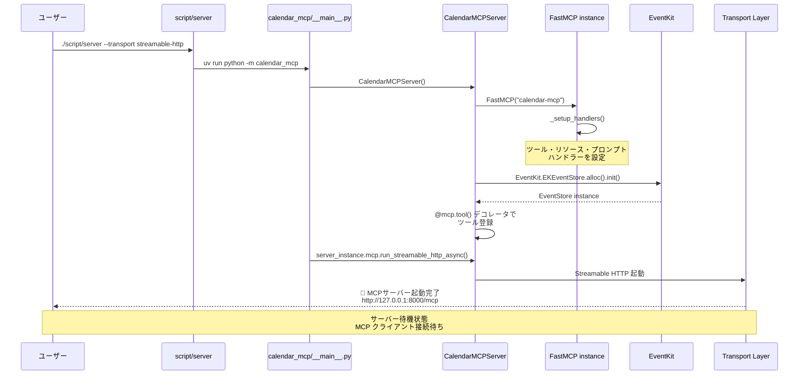
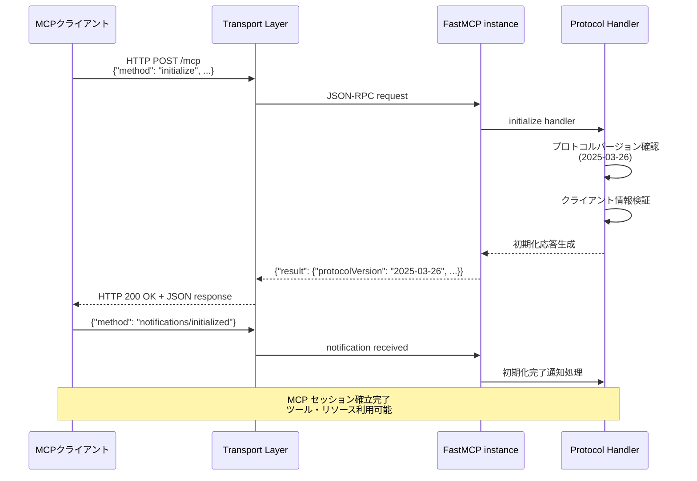
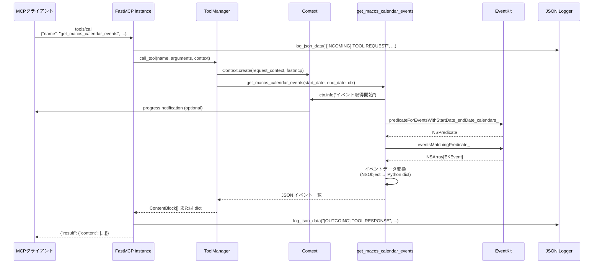
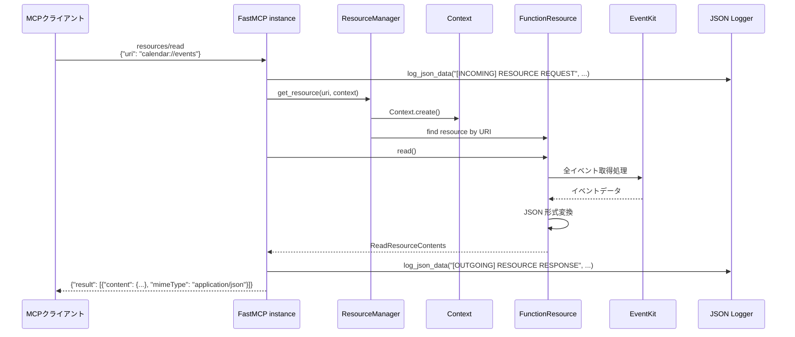
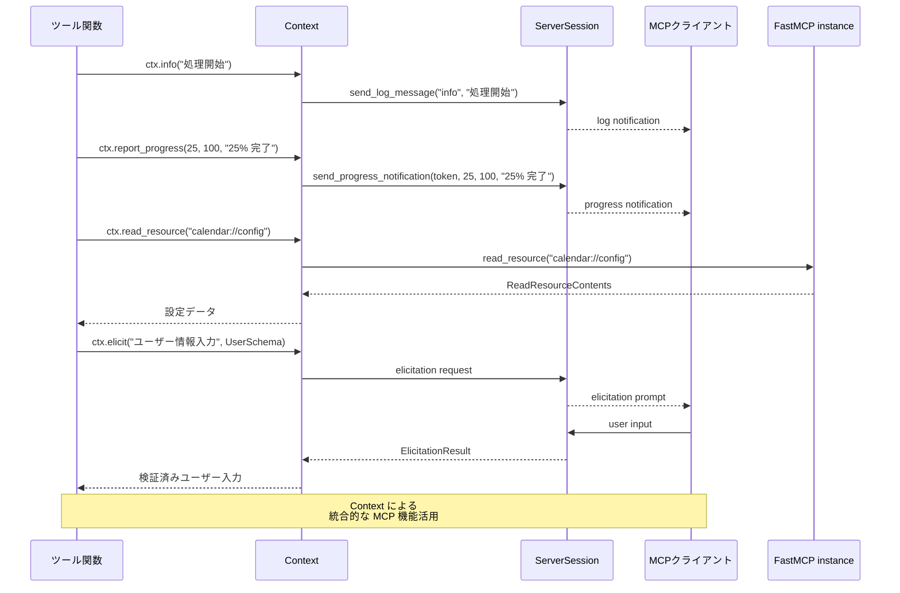
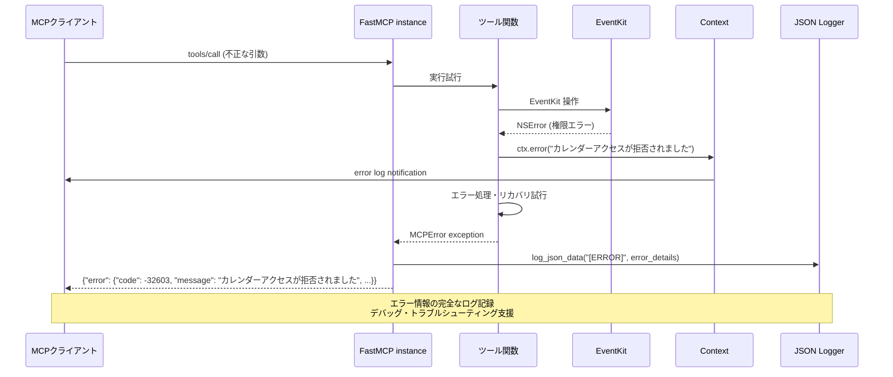
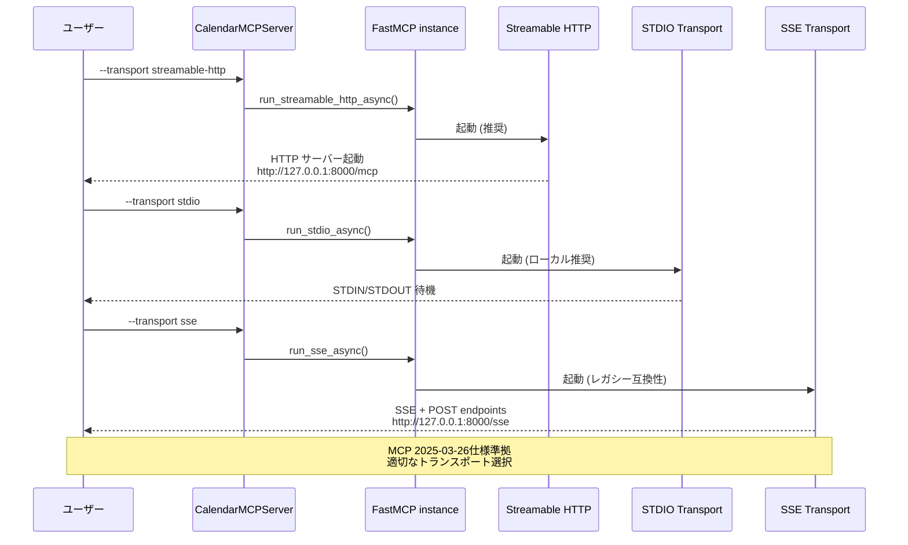

# MCPライブラリリファレンス

このドキュメントでは、myCalendarMCPプロジェクトで使用している主要なライブラリとその詳細な使用方法について解説します。

## 目次
- [利用しているパッケージ](#利用しているパッケージ)
- [MCPライブラリ](#mcpライブラリ)
- [MCPプロトコル動作シーケンス図](#mcpプロトコル動作シーケンス図)
- [EventKitライブラリ](#eventkitライブラリ)
- [その他の依存関係](#その他の依存関係)
- [開発依存関係](#開発依存関係)
- [テスト方法とコード確認手順](#テスト方法とコード確認手順)

## 利用しているパッケージ

### 主要依存関係 (pyproject.toml)

```toml
dependencies = [
    "mcp",                           # Model Context Protocol コアライブラリ
    "pyobjc-framework-EventKit",     # macOS EventKit フレームワークへのPythonバインディング
    "pyobjc-framework-Cocoa",        # macOS Cocoa フレームワークへのPythonバインディング
    "python-dateutil",               # 日付時刻処理拡張ライブラリ
]
```

### 開発依存関係

```toml
[project.optional-dependencies]
dev = [
    "pytest",                        # テストフレームワーク
    "black",                         # コードフォーマッター
    "ruff",                          # リンター・フォーマッター
]
```

## MCPライブラリ

### パッケージ情報
- **バージョン**: `mcp v1.14.0`
- **公式リポジトリ**: https://github.com/modelcontextprotocol/python-sdk
- **ドキュメント**: https://docs.anthropic.com/en/docs/mcp/

### 主要コンポーネント

#### FastMCP
MCPサーバーを簡単に構築するためのフレームワーク

```python
from mcp.server import FastMCP
from mcp.types import ToolAnnotations

# FastMCPインスタンスの作成
server = FastMCP("calendar-mcp")

# ツールの定義例
@server.tool(
    name="get_macos_calendar_events",
    description="macOSカレンダーからイベントを取得",
    annotations=ToolAnnotations(
        readOnlyHint=True,      # 読み取り専用操作
        idempotentHint=True,    # 冪等性がある
        openWorldHint=False     # 閉じた世界の仮定
    ),
)
async def get_calendar_events(start_date: str, end_date: str) -> str:
    # 実装
    pass

# リソースの定義例
@server.resource("calendar://events")
async def read_events() -> str:
    # 実装
    pass
```

### FastMCPクラス詳細解説

#### コンストラクタ (`__init__`)
```python
def __init__(
    self,
    name: str | None = None,                    # MCPサーバー名
    instructions: str | None = None,            # サーバー説明・使用方法
    auth_server_provider: OAuthAuthorizationServerProvider | None = None,  # OAuth認証プロバイダー
    token_verifier: TokenVerifier | None = None,  # トークン検証器
    event_store: EventStore | None = None,      # StreamableHTTP用イベントストア
    *,
    # サーバー基本設定
    tools: list[Tool] | None = None,            # 初期ツール一覧
    debug: bool = False,                        # デバッグモード
    log_level: Literal["DEBUG", "INFO", "WARNING", "ERROR", "CRITICAL"] = "INFO",

    # HTTPトランスポート設定
    host: str = "127.0.0.1",                   # バインドホスト
    port: int = 8000,                          # バインドポート
    mount_path: str = "/",                     # マウントパス
    sse_path: str = "/sse",                    # SSEエンドポイント
    message_path: str = "/messages/",          # メッセージエンドポイント
    streamable_http_path: str = "/mcp",        # StreamableHTTPエンドポイント

    # StreamableHTTP固有設定
    json_response: bool = False,               # JSON形式レスポンス
    stateless_http: bool = False,              # ステートレス HTTP モード

    # 警告制御
    warn_on_duplicate_resources: bool = True,  # 重複リソース警告
    warn_on_duplicate_tools: bool = True,      # 重複ツール警告
    warn_on_duplicate_prompts: bool = True,    # 重複プロンプト警告

    # その他
    dependencies: Collection[str] = (),        # 依存関係リスト（非推奨）
    lifespan: Callable | None = None,          # ライフサイクル管理
    auth: AuthSettings | None = None,          # 認証設定
    transport_security: TransportSecuritySettings | None = None,  # セキュリティ設定
):
```

#### 主要プロパティ

**基本プロパティ:**
```python
@property
def name(self) -> str:
    """MCPサーバー名を取得"""
    return self._mcp_server.name

@property
def instructions(self) -> str | None:
    """サーバーの説明・使用方法を取得"""
    return self._mcp_server.instructions

@property
def session_manager(self) -> StreamableHTTPSessionManager:
    """StreamableHTTPセッションマネージャーを取得（遅延初期化）"""
    if self._session_manager is None:
        raise RuntimeError("streamable_http_app()呼び出し後にのみ利用可能")
    return self._session_manager
```

#### コア機能メソッド

**サーバー実行関連:**
```python
def run(self, transport: Literal["stdio", "sse", "streamable-http"] = "stdio",
        mount_path: str | None = None) -> None:
    """同期的にサーバーを実行（内部でanyio.runを使用）"""

async def run_stdio_async(self) -> None:
    """STDIO トランスポートでの非同期実行"""

async def run_sse_async(self, mount_path: str | None = None) -> None:
    """SSE トランスポートでの非同期実行（uvicorn使用）"""

async def run_streamable_http_async(self) -> None:
    """StreamableHTTP トランスポートでの非同期実行（uvicorn使用）"""
```

**ツール管理:**
```python
def add_tool(self, fn: AnyFunction, name: str | None = None,
             title: str | None = None, description: str | None = None,
             annotations: ToolAnnotations | None = None,
             structured_output: bool | None = None) -> None:
    """プログラムでツールを追加"""

def tool(self, name: str | None = None, title: str | None = None,
         description: str | None = None, annotations: ToolAnnotations | None = None,
         structured_output: bool | None = None) -> Callable:
    """@server.tool()デコレータ（推奨方法）"""

async def list_tools(self) -> list[MCPTool]:
    """利用可能なツール一覧を取得"""

async def call_tool(self, name: str, arguments: dict[str, Any]) -> Sequence[ContentBlock] | dict[str, Any]:
    """ツールを名前で呼び出し"""
```

**リソース管理:**
```python
def add_resource(self, resource: Resource) -> None:
    """プログラムでリソースを追加"""

def resource(self, uri: str, *, name: str | None = None,
             title: str | None = None, description: str | None = None,
             mime_type: str | None = None) -> Callable:
    """@server.resource()デコレータ"""

async def list_resources(self) -> list[MCPResource]:
    """利用可能なリソース一覧を取得"""

async def list_resource_templates(self) -> list[MCPResourceTemplate]:
    """リソーステンプレート一覧を取得"""

async def read_resource(self, uri: AnyUrl | str) -> Iterable[ReadResourceContents]:
    """リソースをURIで読み取り"""
```

**プロンプト管理:**
```python
def add_prompt(self, prompt: Prompt) -> None:
    """プログラムでプロンプトを追加"""

def prompt(self, name: str | None = None, title: str | None = None,
           description: str | None = None) -> Callable:
    """@server.prompt()デコレータ"""

async def list_prompts(self) -> list[MCPPrompt]:
    """利用可能なプロンプト一覧を取得"""

async def get_prompt(self, name: str, arguments: dict[str, Any] | None = None) -> GetPromptResult:
    """プロンプトを名前と引数で取得・レンダリング"""
```

**高度な機能:**
```python
def completion(self) -> Callable:
    """補完ハンドラー登録デコレータ（リソース・プロンプト引数の自動補完）"""

def custom_route(self, path: str, methods: list[str], name: str | None = None,
                 include_in_schema: bool = True) -> Callable:
    """カスタムHTTPルート登録（OAuth コールバック、ヘルスチェック等）"""

def get_context(self) -> Context:
    """現在のリクエストコンテキストを取得（ツール・リソース内で使用）"""
```

**アプリケーション生成:**
```python
def sse_app(self, mount_path: str | None = None) -> Starlette:
    """SSE用Starletteアプリケーションを生成"""

def streamable_http_app(self) -> Starlette:
    """StreamableHTTP用Starletteアプリケーションを生成"""
```

#### プライベート・内部メソッド

**設定・初期化:**
```python
def _setup_handlers(self) -> None:
    """MCPプロトコルハンドラーの設定（list_tools, call_tool等）"""

def _normalize_path(self, mount_path: str, endpoint: str) -> str:
    """マウントパスとエンドポイントの正規化"""
```

#### 使用パターンとベストプラクティス

**基本的な使用パターン:**
```python
from mcp.server import FastMCP
from mcp.types import ToolAnnotations

# 1. インスタンス作成
server = FastMCP(
    name="my-calendar-server",
    instructions="macOSカレンダーとの統合を提供するMCPサーバー",
    debug=False,
    log_level="INFO"
)

# 2. ツール定義（推奨：デコレータパターン）
@server.tool(
    name="get_events",
    description="指定期間のイベントを取得\\n\\nParameters:\\n- start: ISO形式開始日\\n- end: ISO形式終了日",
    annotations=ToolAnnotations(readOnlyHint=True, idempotentHint=True)
)
async def get_events(start: str, end: str) -> str:
    # EventKit を使用した実装
    return json.dumps(events)

# 3. リソース定義
@server.resource("calendar://events")
async def calendar_events() -> str:
    # イベント一覧をJSON形式で返却
    return json.dumps(get_all_events())

# 4. コンテキスト利用例
@server.tool()
async def advanced_tool(param: str, ctx: Context) -> str:
    # ログ出力
    ctx.info(f"Processing: {param}")

    # プログレス報告
    await ctx.report_progress(50, 100, "処理中...")

    # 他のリソース読み取り
    data = await ctx.read_resource("resource://config")

    return result

# 5. カスタムHTTPエンドポイント
@server.custom_route("/health", methods=["GET"])
async def health_check(request: Request) -> Response:
    from starlette.responses import JSONResponse
    return JSONResponse({"status": "healthy", "timestamp": datetime.utcnow().isoformat()})

# 6. サーバー実行
if __name__ == "__main__":
    # 同期実行（推奨）
    server.run(transport="streamable-http", mount_path="/calendar")

    # 非同期実行
    import asyncio
    asyncio.run(server.run_streamable_http_async())
```

**構造化出力の制御:**
```python
# 自動検出（デフォルト）
@server.tool()
async def auto_detect_tool(x: int) -> dict[str, Any]:  # 戻り値型からJSONと推定
    return {"result": x * 2}

# 強制的に構造化出力
@server.tool(structured_output=True)
async def structured_tool(x: int) -> str:  # strでもJSONとして扱う
    return json.dumps({"result": x * 2})

# 強制的に非構造化出力
@server.tool(structured_output=False)
async def unstructured_tool(x: int) -> dict:  # dictでもテキストとして扱う
    return {"message": "処理完了"}
```

**認証設定例:**
```python
from mcp.server.auth.settings import AuthSettings
from mcp.server.auth.provider import SimpleOAuthProvider

# OAuth認証付きサーバー
auth_settings = AuthSettings(
    issuer_url="https://auth.example.com",
    required_scopes=["calendar:read", "calendar:write"]
)

server = FastMCP(
    name="secure-calendar-server",
    auth=auth_settings,
    auth_server_provider=SimpleOAuthProvider(
        client_id="calendar-server",
        client_secret="secret"
    )
)
```

#### トラブルシューティング

**よくあるエラーと解決策:**

1. **`RuntimeError: Already running asyncio in this thread`**
   - 原因: 既存の asyncio event loop 内で `server.run()` を呼び出し
   - 解決: `await server.run_*_async()` メソッドを使用

2. **`TypeError: The @tool decorator was used incorrectly`**
   - 原因: `@server.tool` （括弧なし）で使用
   - 解決: `@server.tool()` （括弧付き）で使用

3. **`ValueError: Mismatch between URI parameters and function parameters`**
   - 原因: リソースURIのパラメータと関数引数が不一致
   - 解決: `@server.resource("resource://{param}")` と `def func(param: str)` を一致させる

4. **`RuntimeError: Session manager can only be accessed after calling streamable_http_app()`**
   - 原因: アプリ生成前に `session_manager` プロパティにアクセス
   - 解決: `server.streamable_http_app()` 呼び出し後にアクセス

### Contextクラス詳細解説

#### 概要
`Context`クラスはMCP機能（ログ出力、プログレス報告、リソースアクセス等）への統一インターフェースを提供し、ツール・リソース関数内で利用できます。

#### コンストラクタ
```python
def __init__(
    self,
    *,
    request_context: RequestContext | None = None,  # 低レベルリクエストコンテキスト
    fastmcp: FastMCP | None = None,                 # FastMCPサーバーインスタンス
    **kwargs: Any,
):
```

#### 主要プロパティ
```python
@property
def fastmcp(self) -> FastMCP:
    """FastMCPサーバーインスタンスへのアクセス"""

@property
def request_context(self) -> RequestContext:
    """低レベルリクエストコンテキストへのアクセス"""

@property
def client_id(self) -> str | None:
    """クライアントIDを取得（利用可能な場合）"""

@property
def request_id(self) -> str:
    """現在のリクエストの一意ID"""

@property
def session(self):
    """基盤セッションへのアクセス（高度な使用方法）"""
```

#### コア機能メソッド

**ログ出力:**
```python
async def log(
    self,
    level: Literal["debug", "info", "warning", "error"],
    message: str,
    *,
    logger_name: str | None = None,
) -> None:
    """指定レベルでログメッセージをクライアントに送信"""

# 便利メソッド
async def debug(self, message: str, **extra: Any) -> None:
    """デバッグレベルログ"""

async def info(self, message: str, **extra: Any) -> None:
    """情報レベルログ"""

async def warning(self, message: str, **extra: Any) -> None:
    """警告レベルログ"""

async def error(self, message: str, **extra: Any) -> None:
    """エラーレベルログ"""
```

**プログレス報告:**
```python
async def report_progress(
    self,
    progress: float,                # 現在の進捗値
    total: float | None = None,     # 総計値（オプション）
    message: str | None = None      # 進捗メッセージ（オプション）
) -> None:
    """進捗状況をクライアントに報告"""
```

**リソースアクセス:**
```python
async def read_resource(self, uri: str | AnyUrl) -> Iterable[ReadResourceContents]:
    """URIでリソースを読み取り"""
```

**対話的入力収集:**
```python
async def elicit(
    self,
    message: str,                           # ユーザーへのメッセージ
    schema: type[ElicitSchemaModelT],       # 期待するレスポンス構造（Pydantic model）
) -> ElicitationResult[ElicitSchemaModelT]:
    """クライアント/ユーザーから情報を対話的に収集"""
```

#### 使用例

**基本的なコンテキスト活用:**
```python
from mcp.server.fastmcp.server import Context

@server.tool(
    name="process_data",
    description="データを処理し、進捗を報告する"
)
async def process_data(data_source: str, ctx: Context) -> str:
    # 情報ログ
    await ctx.info(f"データソース処理開始: {data_source}")

    # 進捗報告
    await ctx.report_progress(0, 100, "初期化中...")

    # 外部リソース読み取り
    config_data = await ctx.read_resource("resource://config")

    # 処理実行（段階的進捗報告）
    for i in range(10):
        # 実際の処理...
        await ctx.report_progress(i * 10, 100, f"ステップ {i+1}/10 処理中...")

    # 完了ログ
    await ctx.info("データ処理が完了しました")

    return "処理完了"
```

**対話的入力収集の例:**
```python
from pydantic import BaseModel

class UserPreferences(BaseModel):
    theme: str  # "light" or "dark"
    language: str  # "ja" or "en"
    notifications: bool

@server.tool()
async def setup_preferences(ctx: Context) -> str:
    # ユーザーから設定を収集
    result = await ctx.elicit(
        message="アプリケーション設定を入力してください",
        schema=UserPreferences
    )

    if result.action == "accept" and result.data:
        await ctx.info(f"設定を保存: {result.data}")
        return f"設定が保存されました: {result.data.model_dump()}"
    elif result.action == "decline":
        await ctx.warning("ユーザーが設定入力を拒否しました")
        return "設定はスキップされました"
    else:  # cancelled
        await ctx.error("設定入力がキャンセルされました")
        return "設定入力がキャンセルされました"
```

**エラーハンドリング付きツール:**
```python
@server.tool()
async def robust_tool(param: str, ctx: Context) -> str:
    try:
        await ctx.info("処理開始")

        # リスキーな処理
        result = await risky_operation(param)

        await ctx.info("処理成功")
        return result

    except ValueError as e:
        await ctx.error(f"パラメータエラー: {e}")
        raise

    except Exception as e:
        await ctx.error(f"予期しないエラー: {e}")
        await ctx.debug(f"詳細エラー情報: {type(e).__name__}: {e}")
        raise
```

#### 利用可能なトランスポート
```python
# MCP 2025-03-26仕様に基づく推奨順位
# 参考: https://modelcontextprotocol.io/specification/2025-06-18/basic/transports

# 1. Streamable HTTP (最推奨: リモートサーバー・スケーラブル)
await server.run_streamable_http_async()

# 2. STDIO (ローカルプロセス推奨: "Clients SHOULD support stdio whenever possible")
await server.run_stdio_async()

# 3. SSE (レガシー互換性のみ: 2024-11-05仕様からの移行期サポート)
await server.run_sse_async(mount_path="/calendar")
```

#### ToolAnnotationsの使い分け
```python
from mcp.types import ToolAnnotations

# 読み取り専用ツール
annotations=ToolAnnotations(
    readOnlyHint=True,
    idempotentHint=True,
    openWorldHint=False
)

# データ変更ツール
annotations=ToolAnnotations(
    destructiveHint=True,
    idempotentHint=False,
    openWorldHint=False
)
```

### Settingsクラス詳細解説

#### 概要
`Settings`クラスはFastMCPサーバーの全設定を管理し、環境変数での設定をサポートします。

#### 主要設定項目

**サーバー基本設定:**
```python
debug: bool                    # デバッグモードの有効化
log_level: Literal[...]        # ログレベル（DEBUG, INFO, WARNING, ERROR, CRITICAL）
```

**HTTP/トランスポート設定:**
```python
host: str                      # バインドホスト（デフォルト: "127.0.0.1"）
port: int                      # バインドポート（デフォルト: 8000）
mount_path: str                # マウントパス（デフォルト: "/"）
sse_path: str                  # SSEエンドポイント（デフォルト: "/sse"）
message_path: str              # メッセージエンドポイント（デフォルト: "/messages/"）
streamable_http_path: str      # StreamableHTTPエンドポイント（デフォルト: "/mcp"）
```

**StreamableHTTP固有設定:**
```python
json_response: bool            # JSON形式レスポンス（デフォルト: False）
stateless_http: bool           # ステートレスHTTPモード（デフォルト: False）
```

**重複警告制御:**
```python
warn_on_duplicate_resources: bool   # 重複リソース警告（デフォルト: True）
warn_on_duplicate_tools: bool       # 重複ツール警告（デフォルト: True）
warn_on_duplicate_prompts: bool     # 重複プロンプト警告（デフォルト: True）
```

**高度な設定:**
```python
dependencies: list[str]             # 依存関係リスト（非推奨）
lifespan: Callable                  # ライフサイクル管理関数
auth: AuthSettings                  # 認証設定
transport_security: TransportSecuritySettings  # セキュリティ設定
```

#### 環境変数での設定
全ての設定は`FASTMCP_`プレフィックスで環境変数から設定可能：

```bash
# 基本設定
export FASTMCP_DEBUG=true
export FASTMCP_LOG_LEVEL=DEBUG

# サーバー設定
export FASTMCP_HOST=0.0.0.0
export FASTMCP_PORT=3000

# 警告制御
export FASTMCP_WARN_ON_DUPLICATE_TOOLS=false

# ネストした設定（OAuth等）
export FASTMCP_AUTH__ISSUER_URL=https://auth.example.com
export FASTMCP_TRANSPORT_SECURITY__ALLOWED_ORIGINS='["https://trusted.example.com"]'
```

### StreamableHTTPASGIAppクラス詳細解説

#### 概要
StreamableHTTPトランスポートのASGI互換アプリケーションラッパーです。

#### 構造
```python
class StreamableHTTPASGIApp:
    def __init__(self, session_manager: StreamableHTTPSessionManager):
        self.session_manager = session_manager

    async def __call__(self, scope: Scope, receive: Receive, send: Send) -> None:
        """標準ASGIアプリケーションインターフェース"""
        await self.session_manager.handle_request(scope, receive, send)
```

#### 使用方法
通常は直接使用せず、`server.streamable_http_app()`経由で利用します：

```python
# 内部的に StreamableHTTPASGIApp が使用される
starlette_app = server.streamable_http_app()

# 高度な使用例: カスタムASGIミドルウェアとの統合
from starlette.middleware import Middleware
from starlette.middleware.cors import CORSMiddleware

middleware = [
    Middleware(CORSMiddleware, allow_origins=["*"]),
]

# StreamableHTTPASGIAppを直接取得してカスタマイズ
session_manager = server.session_manager
asgi_app = StreamableHTTPASGIApp(session_manager)
```

### 内部依存関係

FastMCPは以下のライブラリに依存：
- `anyio v4.10.0`: 非同期I/Oライブラリ
- `httpx v0.28.1`: HTTP クライアントライブラリ
- `pydantic v2.11.9`: データバリデーション
- `starlette v0.48.0`: ASGI Webフレームワーク
- `uvicorn v0.35.0`: ASGI サーバー

## MCPプロトコル動作シーケンス図

### 1. FastMCP サーバー初期化・起動シーケンス



### 2. MCP クライアント接続・初期化シーケンス



### 3. MCP ツール呼び出しシーケンス（get_macos_calendar_events）



### 4. MCP リソース読み取りシーケンス（calendar://events）



### 5. Context オブジェクト活用シーケンス



### 6. エラーハンドリング・復旧シーケンス



### 7. 複数トランスポート対応シーケンス



### テスト用MCPクライアント実装

```python
import json
import subprocess
import asyncio

class MCPClient:
    def __init__(self, process):
        self.process = process
        self.request_id = 0

    def send_request(self, method, params=None):
        """JSON-RPC リクエストを送信"""
        self.request_id += 1
        request = {
            "jsonrpc": "2.0",
            "method": method,
            "id": self.request_id,
            "params": params or {}
        }

        request_json = json.dumps(request) + "\n"
        self.process.stdin.write(request_json.encode())
        self.process.stdin.flush()

        # レスポンス読み取り
        response_line = self.process.stdout.readline().decode()
        return json.loads(response_line)

    def initialize_mcp(self):
        """MCPプロトコル初期化"""
        # 初期化リクエスト
        init_response = self.send_request("initialize", {
            "protocolVersion": "2024-11-05",
            "capabilities": {},
            "clientInfo": {
                "name": "mcp-client-test",
                "version": "1.0.0"
            }
        })

        # 初期化完了通知
        self.send_notification("notifications/initialized")

        return init_response

    def send_notification(self, method, params=None):
        """通知（レスポンス不要）を送信"""
        notification = {
            "jsonrpc": "2.0",
            "method": method,
            "params": params or {}
        }

        notification_json = json.dumps(notification) + "\n"
        self.process.stdin.write(notification_json.encode())
        self.process.stdin.flush()

# 使用例
async def test_mcp_client():
    # MCPサーバー起動
    process = subprocess.Popen(
        ["script/server", "--transport", "stdio"],
        stdin=subprocess.PIPE,
        stdout=subprocess.PIPE,
        stderr=subprocess.PIPE,
        text=False
    )

    client = MCPClient(process)

    # プロトコル初期化
    client.initialize_mcp()

    # ツール呼び出し
    response = client.send_request("tools/call", {
        "name": "list_macos_calendars",
        "arguments": {}
    })

    print(f"Response: {response}")

    process.terminate()
```

## EventKitライブラリ

### パッケージ情報
- **バージョン**: `pyobjc-framework-eventkit v11.1`
- **コア**: `pyobjc-core v11.1`
- **依存**: `pyobjc-framework-cocoa v11.1`

### 基本的な使用方法

#### EventStore初期化
```python
try:
    import EventKit
    EVENTKIT_AVAILABLE = True
except ImportError:
    EVENTKIT_AVAILABLE = False
    EventKit = None

if EVENTKIT_AVAILABLE:
    # EventStoreインスタンス作成
    event_store = EventKit.EKEventStore.alloc().init()

    # カレンダーアクセス許可確認
    access_granted = event_store.authorizationStatusForEntityType_(
        EventKit.EKEntityTypeEvent
    ) == EventKit.EKAuthorizationStatusAuthorized
```

#### カレンダー一覧取得
```python
def get_calendars():
    """利用可能なカレンダー一覧を取得"""
    if not EVENTKIT_AVAILABLE:
        return []

    calendars = event_store.calendarsForEntityType_(EventKit.EKEntityTypeEvent)
    calendar_list = []

    for calendar in calendars:
        calendar_info = {
            "title": str(calendar.title()),
            "type": str(calendar.type()),
            "allowsContentModifications": bool(calendar.allowsContentModifications()),
            "color": calendar.color().description() if calendar.color() else None,
            "source": str(calendar.source().title()) if calendar.source() else None
        }
        calendar_list.append(calendar_info)

    return calendar_list
```

#### イベント取得
```python
from datetime import datetime, timedelta
import EventKit

def get_events(start_date: datetime, end_date: datetime, calendar_name: str = None):
    """指定期間のイベントを取得"""
    if not EVENTKIT_AVAILABLE:
        return []

    # NSDateに変換
    from Foundation import NSDate
    start_ns_date = NSDate.dateWithTimeIntervalSince1970_(start_date.timestamp())
    end_ns_date = NSDate.dateWithTimeIntervalSince1970_(end_date.timestamp())

    # 述語作成
    predicate = event_store.predicateForEventsWithStartDate_endDate_calendars_(
        start_ns_date, end_ns_date, None
    )

    # イベント取得
    events = event_store.eventsMatchingPredicate_(predicate)

    event_list = []
    for event in events:
        # カレンダー名フィルタリング
        if calendar_name and str(event.calendar().title()) != calendar_name:
            continue

        event_info = {
            "title": str(event.title()) if event.title() else "",
            "start_date": event.startDate().description(),
            "end_date": event.endDate().description(),
            "calendar": str(event.calendar().title()),
            "notes": str(event.notes()) if event.notes() else "",
            "location": str(event.location()) if event.location() else "",
            "allDay": bool(event.isAllDay()),
            "url": str(event.URL()) if event.URL() else ""
        }
        event_list.append(event_info)

    return event_list
```

#### イベント作成
```python
def create_event(title: str, start_date: datetime, end_date: datetime,
                calendar_name: str = None, notes: str = "", location: str = ""):
    """新しいイベントを作成"""
    if not EVENTKIT_AVAILABLE:
        return {"success": False, "error": "EventKit not available"}

    # カレンダー取得
    calendars = event_store.calendarsForEntityType_(EventKit.EKEntityTypeEvent)
    target_calendar = None

    for calendar in calendars:
        if calendar_name is None or str(calendar.title()) == calendar_name:
            if calendar.allowsContentModifications():
                target_calendar = calendar
                break

    if not target_calendar:
        return {"success": False, "error": "No writable calendar found"}

    # イベント作成
    new_event = EventKit.EKEvent.eventWithEventStore_(event_store)
    new_event.setTitle_(title)

    # 時刻設定
    from Foundation import NSDate
    start_ns_date = NSDate.dateWithTimeIntervalSince1970_(start_date.timestamp())
    end_ns_date = NSDate.dateWithTimeIntervalSince1970_(end_date.timestamp())

    new_event.setStartDate_(start_ns_date)
    new_event.setEndDate_(end_ns_date)
    new_event.setCalendar_(target_calendar)

    if notes:
        new_event.setNotes_(notes)
    if location:
        new_event.setLocation_(location)

    # イベント保存
    error = event_store.saveEvent_span_error_(
        new_event, EventKit.EKSpanThisEvent, None
    )

    if error[1]:  # エラーが発生した場合
        return {"success": False, "error": str(error[1])}

    return {
        "success": True,
        "event_id": str(new_event.eventIdentifier()),
        "calendar": str(target_calendar.title())
    }
```

### EventKit エラーハンドリング

```python
def check_calendar_access():
    """カレンダーアクセス権限チェック"""
    if not EVENTKIT_AVAILABLE:
        return False, "EventKit framework not available"

    status = event_store.authorizationStatusForEntityType_(EventKit.EKEntityTypeEvent)

    if status == EventKit.EKAuthorizationStatusNotDetermined:
        return False, "Calendar access not determined"
    elif status == EventKit.EKAuthorizationStatusRestricted:
        return False, "Calendar access restricted"
    elif status == EventKit.EKAuthorizationStatusDenied:
        return False, "Calendar access denied"
    elif status == EventKit.EKAuthorizationStatusAuthorized:
        return True, "Calendar access authorized"
    else:
        return False, f"Unknown authorization status: {status}"
```

## その他の依存関係

### python-dateutil
- **バージョン**: `v2.9.0.post0`
- **用途**: 柔軟な日付時刻パースとタイムゾーン処理

```python
from dateutil.parser import parse as parse_date
from dateutil.tz import gettz

# 柔軟な日付パース
date_str = "2024-12-25 10:30:00"
parsed_date = parse_date(date_str)

# タイムゾーン処理
tokyo_tz = gettz("Asia/Tokyo")
localized_date = parsed_date.replace(tzinfo=tokyo_tz)
```

## 開発依存関係

### pytest
- **バージョン**: `v8.4.2`
- **設定**: `pyproject.toml`の`[tool.pytest.ini_options]`

```bash
# 基本的なテスト実行
uv run pytest tests/ -v

# 特定のテストクラス実行
uv run pytest tests/test_tools.py::TestCalendarMCPTools -v

# カバレッジ付きテスト実行
uv run pytest tests/ --cov=calendar_mcp --cov-report=html
```

### black / ruff
- **Black バージョン**: `v25.1.0`
- **Ruff バージョン**: `v0.13.0`
- **設定**: 行長88文字、Python 3.8+ 対応

```bash
# コードフォーマット
uv run black calendar_mcp/ tests/

# リント実行
uv run ruff check calendar_mcp/ tests/

# 自動修正付きリント
uv run ruff check --fix calendar_mcp/ tests/
```

## テスト方法とコード確認手順

### 1. 環境セットアップ

```bash
# 依存関係インストール
uv install

# 開発用依存関係も含めてインストール
uv install --dev
```

### 2. 依存関係確認

```bash
# 依存関係ツリー表示
uv tree

# 特定パッケージの詳細確認
uv show mcp
uv show pyobjc-framework-eventkit
```

### 3. コード品質チェック

```bash
# 統合スクリプトでテスト実行
script/test

# 手動での段階的実行
uv run ruff check calendar_mcp/ tests/      # リント
uv run black --check calendar_mcp/ tests/   # フォーマット確認
uv run pytest tests/ -v                    # テスト実行
```

### 4. MCPサーバー動作確認

```bash
# 基本動作確認
script/server

# MCPクライアント経由の統合テスト
script/mcp_client_test

# 特定のトランスポートでテスト
script/server --transport stdio
script/server --transport sse
```

### 5. EventKit機能確認

```python
# EventKit利用可能性チェック
python3 -c "
try:
    import EventKit
    store = EventKit.EKEventStore.alloc().init()
    print('EventKit: Available')

    status = store.authorizationStatusForEntityType_(EventKit.EKEntityTypeEvent)
    print(f'Authorization Status: {status}')
    print(f'Authorized: {status == EventKit.EKAuthorizationStatusAuthorized}')
except Exception as e:
    print(f'EventKit: Not Available - {e}')
"
```

### 6. パフォーマンステスト

```bash
# メモリ使用量監視
script/server &
PID=$!
while kill -0 $PID 2>/dev/null; do
    ps -p $PID -o pid,vsz,rss,pcpu,time
    sleep 1
done
```

### 7. ログレベル調整

```python
import logging

# デバッグレベルでの詳細ログ
logging.getLogger('calendar_mcp').setLevel(logging.DEBUG)
logging.getLogger('calendar_mcp.server.json_data').setLevel(logging.INFO)

# 基本的な設定
logging.basicConfig(
    level=logging.INFO,
    format='%(asctime)s - %(name)s - %(levelname)s - %(message)s'
)
```

### 8. トラブルシューティング

#### よくある問題と解決策

**EventKitアクセス拒否:**
```bash
# システム設定でカレンダーアクセスを確認
open "x-apple.systempreferences:com.apple.preference.security?Privacy_Calendars"
```

**依存関係の競合:**
```bash
# 仮想環境の再作成
uv venv --python 3.10
source .venv/bin/activate
uv install
```

**MCPプロトコルエラー:**
```bash
# デバッグモードでサーバー起動
PYTHONPATH=. python -m calendar_mcp --transport stdio --debug
```

**テスト失敗時の詳細確認:**
```bash
# 詳細出力とログ付きテスト
uv run pytest tests/ -v -s --tb=long --log-cli-level=DEBUG
```

## まとめ

このプロジェクトでは、以下の主要技術スタックを使用してMCPサーバーを実装しています：

1. **MCP (Model Context Protocol)**: AI エージェントとの標準プロトコル
2. **EventKit**: macOSネイティブカレンダーアクセス
3. **FastMCP**: 高レベルMCPサーバーフレームワーク
4. **pyobjc**: Objective-C ブリッジによるmacOS API アクセス

各ライブラリの適切な使用により、堅牢で拡張性のあるMCPサーバーを実現しています。
